# RAAD Platform — Phase 2: Enterprise System Architecture (v1)

**Prepared by:** Senior Enterprise Software Architect
**Phase:** Architecture design (no implementation code)
**Sources of truth:** `CLAUDE.md`, `docs/business/Project_Brief_v1.md` (Ch. 1–11), Phase-1 Validation Review, and the owner's six locked decisions.
**Date:** 2026-07-10
**Status:** For review

---

## 0. Locked decisions this architecture is built on

These are fixed inputs; the whole design conforms to them.

| # | Decision | Architectural consequence |
|---|----------|---------------------------|
| D1 | **No per-student boarding in MVP.** Notifications from trip lifecycle + geofence events only. RFID / face / QR / AI boarding are future. | No boarding-capture subsystem. Notification triggers derive purely from trip state and geofence crossings. Data model keeps a *future* extension seam for boarding events but builds none. |
| D2 | **Notification channels = FCM push + in-app center only.** SMS/Email/WhatsApp out of scope. | One outbound push adapter (FCM) + an in-app notification store. Channel abstraction exists so future channels plug in, but only FCM is implemented. |
| D3 | **School-bus transportation only.** Commercial/logistics/employee/public transport are future phases. | Domain model is student-transport-shaped. `Organization` carries an `org_type` seam for future variants, but only `SCHOOL` behavior is designed. |
| D4 | **Safety first: subscription expiry never stops GPS tracking or safety notifications.** Premium features may be restricted. | Subscription/entitlement checks are applied only to *premium/convenience* capabilities. A hard invariant excludes safety-critical tracking and safety notifications from any billing gate. |
| D5 | **Parents never see in-cabin live video.** Only Organization Administrators view live video and playback. Parents get GPS + trip notifications. | Video authorization is role-gated to Org Admin (and RAAD staff where explicitly permitted). Parent-facing surfaces expose GPS + notifications only; no video endpoints are reachable by the Parent role. |
| D6 | **Device communication split into dedicated planes:** JT808 TCP Server (GPS/telematics), JT1078 Video Server (live/playback), FastAPI Business API, with event-driven communication between services. | Three first-class deployables plus an event bus. FastAPI never terminates a device socket. |

**Guardrails honored throughout:** RAAD is *not* a school ERP (no attendance records, payroll, exams/gradebook, LMS). No unnecessary complexity — the MVP is a **modular monolith** for business logic plus **separate device/media services**, not a premature microservice mesh.

---

## 1. High-Level System Architecture

### 1.1 Architectural style

- **Modular Monolith** for all business logic (FastAPI), organized into strict internal modules aligned to bounded contexts — one deployable, clean module seams, ready to peel off into services later.
- **Separated Device Connectivity Plane** (JT808 + JT1078) as independent services, because these speak persistent-TCP/streaming protocols that must never live inside the REST app (D6).
- **Event-Driven backbone** connecting the device plane to the business plane and to notifications.
- **Multi-Tenant SaaS** with strict per-organization isolation.
- **API-First**: every capability is exposed through a versioned contract before any UI consumes it.

### 1.2 Logical planes (system context)

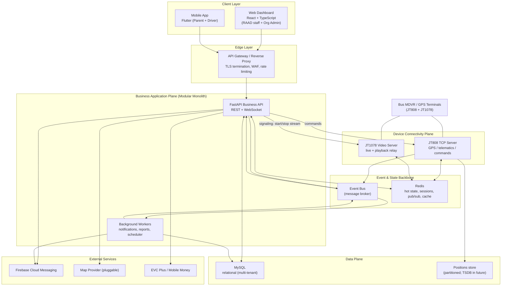

### 1.3 MVP deployables (kept deliberately small)

1. **Business API** (FastAPI modular monolith; serves REST + WebSocket to clients).
2. **JT808 TCP Server** (device GPS/telematics ingestion + command downlink).
3. **JT1078 Video Server** (live-stream/playback signaling + media relay/repackaging).
4. **Worker runtime** (notification dispatch, report generation, scheduled trip generation, geofence evaluation). May run in-process with the API at the smallest scale, but is designed as a separable process.

**Shared infrastructure:** MySQL, Redis, an event broker, an object store (only for *generated* artifacts like report PDFs/exports — **not** video), plus external FCM / Maps / Payment.

### 1.4 Key end-to-end flows (named here, detailed later)

- **Live tracking:** MDVR → JT808 Server → normalize → event bus + Redis latest-position → WebSocket push to authorized clients + geofence/notification evaluation.
- **Live video (admin only):** Org Admin request → Business API authorizes (D5) → signaling to JT1078 Server → device streams to media server → repackaged to browser-playable stream → Org Admin only.
- **Notifications:** trip-lifecycle/geofence event → notification service → FCM push + in-app center (D1, D2).
- **Billing:** subscription lifecycle governs *premium* entitlements only; safety tracking always on (D4).

---

## 2. Domain Architecture (DDD)

### 2.1 Bounded contexts

RAAD decomposes into ten bounded contexts. Each owns its data and exposes behavior through interfaces; cross-context communication is via events (async) or explicit application-service calls (sync, in-process for MVP).

| # | Bounded Context | Core responsibility | Key aggregates |
|---|-----------------|---------------------|----------------|
| C1 | **Identity & Access (IAM)** | AuthN, RBAC, sessions, tenant context | User, Role, Permission, Session |
| C2 | **Organization / Tenant** | Customer orgs, settings, org users, isolation root | Organization, OrgSettings, OrgUser |
| C3 | **Fleet & Device** | Vehicles and GPS/MDVR devices, assignment, connectivity state | Vehicle, Device, Camera |
| C4 | **Transport Operations** | Students, parents, routes, stops, trips, assignments | Student, Parent, Route, Stop, Trip, Assignment |
| C5 | **Tracking & Telemetry** | Position ingestion (from device plane), live state, geofence evaluation, trip-position history | VehiclePosition, GeofenceState, LiveTrack |
| C6 | **Video Monitoring** | Live-video/playback session control (admin-only) | VideoSession, PlaybackRequest |
| C7 | **Notifications** | Event→notification rules, delivery (FCM + in-app), history | Notification, NotificationPreference, DeviceToken |
| C8 | **Subscription & Billing** | Plans, subscriptions, invoices, payments, entitlements | Subscription, Plan, Invoice, Payment, TransportFee |
| C9 | **Reporting & Analytics** | Operational/payment reports, dashboards, exports | ReportDefinition, ReportRun |
| C10 | **Platform & Audit** | System settings, audit log, integrations, config | AuditEntry, SystemSetting, Integration |

### 2.2 Context map (relationships)

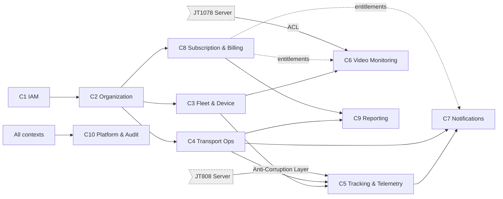

**Relationship notes**

- **Tracking & Video treat the device plane through an Anti-Corruption Layer (ACL):** raw JT808/JT1078 vendor dialects are normalized into clean domain events before entering the model, protecting the domain from protocol/vendor quirks (addresses Phase-1 risk R8).
- **Billing is *downstream advisory* to Video and Notifications for entitlements only.** Per D4, it can restrict *premium* video/notification features but can never suppress safety tracking or safety notifications. This is encoded as a domain policy, not a call-site convention (see §12.6).
- **Platform & Audit** is a generic supporting context every context writes to.

### 2.3 Ubiquitous language

The domain uses the brief's Ch. 6 vocabulary verbatim (Organization, Vehicle, Device, Driver, Student, Parent, Route, Stop, Trip, Subscription). "Trip" is the operational aggregate root for a day's journey; "Assignment" binds Student↔Route↔Stops and Vehicle↔Driver↔Route.

### 2.4 Core invariants (from Ch. 7, encoded as domain rules)

- One organization owns all its vehicles/devices/drivers/students/routes/trips (tenant boundary).
- One Device ↔ one Vehicle (active); one Vehicle ↔ one active Device.
- A Vehicle has at most one *active* Trip at a time; may run many Trips per day.
- Every Student belongs to one org, has ≥1 Parent, one Route, one pickup Stop, one drop-off Stop, one transport-payment record.
- Every Trip has one Vehicle, one Driver, one Route, a start and end; morning/afternoon are independent Trips.
- Parents access only their own children; drivers only assigned vehicles; live parent tracking exists only during active trips.

---

## 3. Module Architecture (inside the Business monolith)

### 3.1 Module layout

Each bounded context (that lives in the monolith) maps to a **module** with an identical internal shape. Modules never reach into each other's internals; they talk through published module interfaces or domain events.

```
raad_business_api/
├── core/                 # cross-cutting: config, security, tenancy, events, errors, logging
├── modules/
│   ├── iam/              # C1
│   ├── organization/     # C2
│   ├── fleet_device/     # C3
│   ├── transport_ops/    # C4
│   ├── tracking/         # C5  (consumes device-plane events; no socket handling here)
│   ├── video/            # C6  (signaling client to JT1078 server; authz only)
│   ├── notifications/    # C7
│   ├── billing/          # C8
│   ├── reporting/        # C9
│   └── platform_audit/   # C10
└── interfaces/           # REST routers, WebSocket handlers, worker entrypoints
```

Each module internally:

```
modules/<context>/
├── api/          # routers / schemas (DTOs) — the module's public HTTP surface
├── domain/       # entities, value objects, aggregates, domain services, policies
├── application/  # use-cases / application services (orchestration, transactions)
├── infra/        # repositories (SQLAlchemy), external adapters
└── events/       # event publishers + subscribers (contracts)
```

### 3.2 Module boundary rules

- **Dependency direction:** `api → application → domain`; `infra` implements interfaces the domain defines (dependency inversion). Domain never imports infra or FastAPI.
- **No cross-module DB reads.** A module reads only its own tables. Cross-context data is obtained via the owning module's application service or via events/read-models.
- **API-first contracts.** Inter-module and external contracts are defined as schemas first.
- **Tenancy is cross-cutting** (in `core/tenancy`): a tenant context is resolved at the edge and injected into every repository query (see §10.2 and §12.3).

### 3.3 Why modular monolith now (and not microservices)

Aligns with the brief (11.2) and "no unnecessary complexity." One business deployable is cheaper to build, test, and operate at MVP scale, while strict module seams make later extraction (§13) a mechanical refactor rather than a rewrite. The genuinely different runtime concerns — persistent device sockets and media relay — are *already* separated (D6), which is where separation actually pays off.

---

## 4. Service Architecture

### 4.1 Services and responsibilities

| Service | Type | Inbound | Outbound | Scaling model |
|---------|------|---------|----------|---------------|
| **Business API** | Request/response + WebSocket | HTTPS (clients) | MySQL, Redis, broker, FCM, Maps, Payment, JT808 cmd, JT1078 signaling | Stateless → horizontal |
| **JT808 TCP Server** | Long-lived TCP | Device TCP sockets | broker (position/status events), Redis (session + latest position), MySQL (device state) | Sharded by device (sticky) |
| **JT1078 Video Server** | Streaming/media | Device media stream + API signaling | Redis (session), client media (WebRTC/HLS/FLV) | Scale by concurrent streams |
| **Worker runtime** | Async consumers + scheduler | broker, cron ticks | MySQL, FCM, object store | Horizontal by queue |

### 4.2 Communication contracts

- **Client ↔ Business API:** REST (CRUD, commands) + WebSocket (live position stream, live notifications).
- **Business API ↔ JT808 Server:** the API issues *commands* (e.g., request real-time A/V transmission, remote config) via the broker or a small internal RPC; the JT808 server executes the JT808 downlink. The API never opens a device socket.
- **Business API ↔ JT1078 Server:** signaling only — "start live for camera X / stop / request playback window," plus session/port info returned for the client player. Authorization (D5) happens in the API *before* signaling.
- **Device plane → Business plane:** exclusively asynchronous domain events over the broker (`DevicePositionReported`, `DeviceOnline`, `DeviceOffline`, `DeviceAlarmRaised`, `VideoStreamReady`, …).
- **Workers:** subscribe to domain events; run the scheduler (daily trip generation, subscription-status sweeps) and background jobs (report rendering).

### 4.3 Broker choice (MVP → scale)

- **MVP:** a lightweight broker with durable streams — **Redis Streams or RabbitMQ** — sufficient for the event volume and simplest to operate.
- **Scale path:** migrate the high-throughput position/telemetry topics to **Kafka** when ingestion outgrows the MVP broker (see §13). The event contracts are broker-agnostic so this is a transport swap, not a redesign.

---

## 5. Device Communication Architecture (JT808 / JT1078)

This is the highest-risk subsystem (Phase-1 R1/R2) and is designed as its own plane.

### 5.1 JT808 TCP Server (GPS & telematics)

**Purpose:** terminate persistent TCP connections from bus terminals, parse JT/T 808 messages, maintain device sessions, normalize telemetry into domain events, and relay platform commands down to devices.

**Connection & session lifecycle**

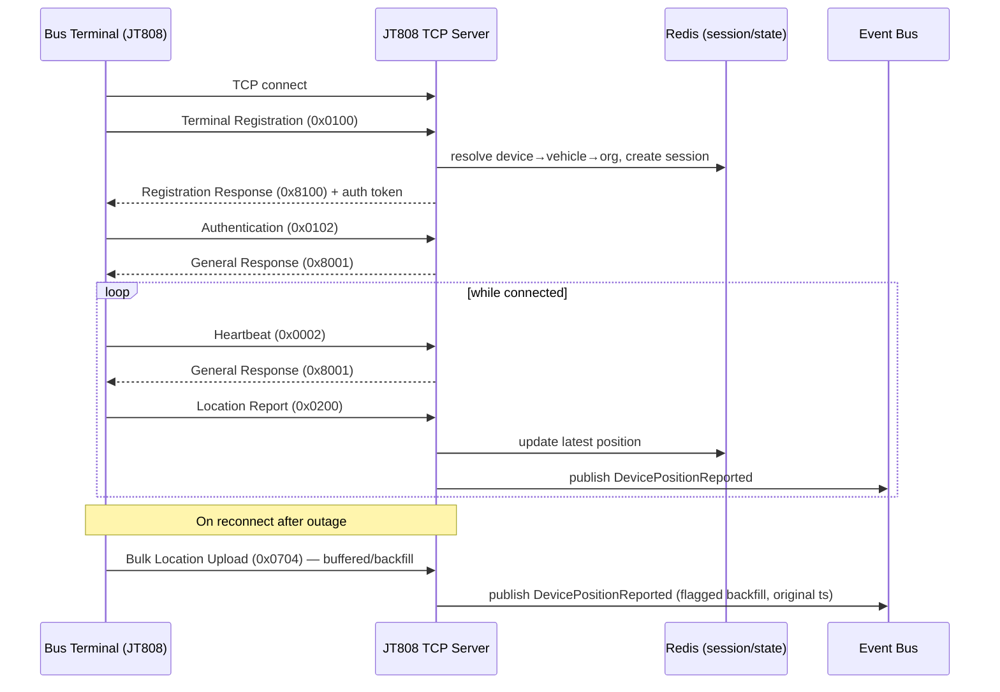

**Design specifics**

- **Session registry in Redis:** `device_id → {connection node, vehicle_id, org_id, last_seen, auth_state}`. Enables sharding and fast device→tenant resolution.
- **Device authentication:** registration/auth keys provisioned during device onboarding (Device Management). Unknown or unauthenticated devices are rejected and logged (audit).
- **Normalization / ACL:** raw messages pass through a **vendor-adapter layer** that maps dialect variations (extra fields, alarm-bit conventions) into a canonical `PositionReport` value object before publishing. New vendor = new adapter, no core change (mitigates R8).
- **Backfill handling (Phase-1 gap):** buffered positions (0x0704 and late 0x0200s) are published with their **original timestamps** and a `backfill=true` flag. Live views use only `event_time ≈ now`; trip history ingests backfilled points and re-orders by timestamp. This prevents stale buffered data from corrupting the live map (R3).
- **Command downlink:** platform-issued commands (request real-time A/V `0x9101`, playback `0x9201/0x9205`, config, text) are delivered to the device over its live session; correlation IDs track responses back to the requesting use-case.
- **Connectivity monitoring:** heartbeat/keepalive timeouts emit `DeviceOffline`; reconnect emits `DeviceOnline`. Feeds device-status monitoring and exception workflows (Ch. 8.9).

**Scaling:** device connections are sticky to a gateway node; horizontal scale by **sharding devices across gateway instances** (e.g., by device-id hash), with the Redis session registry as the shared source of truth. Load balancer must support raw TCP with sticky routing.

### 5.2 JT1078 Video Server (live & playback) — **admin-only (D5)**

**Purpose:** on-demand live video and playback relay. RAAD is *not* a video archive (brief 11.9) — the MDVR remains the system of record; this server relays streams on demand only.

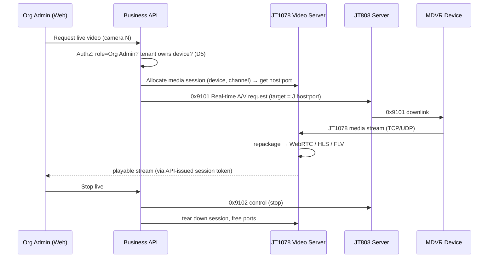

**Design specifics**

- **Authorization gate is in the Business API, before any signaling.** The Parent role has **no** code path that can allocate a media session or receive a stream token (D5). Only Org Admin (and explicitly-permitted RAAD staff) may. This is enforced by RBAC + a video-access domain policy, and every access is audited.
- **Media repackaging:** JT1078 frames are repackaged to a browser/Flutter-playable transport (WebRTC for low latency, or HLS/FLV) by the media server; clients never speak JT1078 directly.
- **Playback:** admin requests a time window; the server commands the MDVR to stream the recording (availability depends on MDVR retention, per 11.9). No cloud copy is made by default.
- **Concurrency control:** a per-org and global **max-concurrent-stream ceiling** (Phase-1 gap) protects bandwidth/CPU; requests beyond the ceiling queue or are refused with a clear message. Port ranges are pooled and reclaimed on teardown.
- **Scaling:** scale by concurrent streams; media nodes are horizontally added, with the session registry in Redis and sticky media routing. Public reachability (stable host:port, UDP where used) is a deployment requirement (§11).

### 5.3 Security of the device plane

JT808/JT1078 have weak native security. Mitigations: device auth keys, IP/APN allow-listing where the mobile operator supports it, network isolation of the device-facing subnet, TLS/again where the terminal supports it, and strict rate/heartbeat anomaly detection. Detail in §12.7.

---

## 6. Event Flow Architecture

### 6.1 Event taxonomy

- **Telemetry events (device plane):** `DevicePositionReported`, `DeviceOnline`, `DeviceOffline`, `DeviceAlarmRaised`, `VideoStreamReady`.
- **Operational/domain events (business plane):** `TripStarted`, `TripEnded`, `VehicleEnteredStopGeofence`, `VehicleApproachingStop`, `VehicleArrivedAtOrganization`, `SubscriptionStatusChanged`.
- **Notification events:** `NotificationRequested` → `NotificationDelivered`/`NotificationFailed`.

Events are versioned, tenant-stamped (`org_id`), and carry correlation IDs.

### 6.2 Trip lifecycle state machine

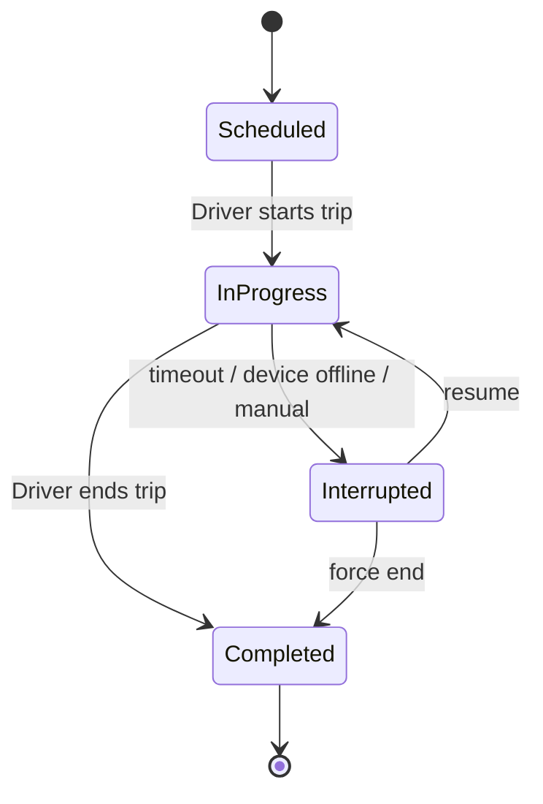

- **Trip start (by driver)** activates live tracking for the trip's vehicle and opens parent visibility for that trip's students' parents.
- **Trip end** closes parent live visibility and persists the trip's position history.
- Morning/afternoon are independent Trip instances (Ch. 7.9).

### 6.3 The core notification flow (D1 + D2)

Because there is **no per-student boarding** (D1), notification triggers are **trip-lifecycle + geofence** only:

```mermaid
flowchart LR
  POS[DevicePositionReported] --> GEO{Geofence eval\n(Tracking)}
  TRIP[TripStarted / TripEnded] --> RULES[Notification rules]
  GEO -->|entered stop radius| APPR[VehicleApproachingStop]
  GEO -->|reached org| ARR[VehicleArrivedAtOrganization]
  APPR --> RULES
  ARR --> RULES
  RULES --> REQ[NotificationRequested\n(recipients = authorized parents/admins)]
  REQ --> FCM[FCM push]
  REQ --> INAPP[In-App Center store]
```

**Notification catalog for MVP** (mapped to Ch. 7.11, minus student-level events):

- Morning Trip Started / Afternoon Trip Started
- Vehicle Approaching Pickup Stop / Approaching Drop-off Stop (geofence-triggered, per the stop a parent's child is assigned to)
- Vehicle Arrived at Organization
- Trip Completed

**Recipient scoping:** the notification service resolves recipients from Transport-Ops assignments (a parent gets "approaching" only for the stop their child is assigned to) and enforces parent-only-own-children. Delivery = FCM push + persisted in-app entry. Deferred/failed pushes retry with backoff; the in-app center is the durable record.

### 6.4 Geofence evaluation

Tracking maintains per-active-trip geofence state for the route's stops. Each incoming live position is tested against upcoming stop radii and the organization geofence. Crossings emit approach/arrival events with de-duplication (a vehicle lingering in a radius fires once). "Approaching" uses a configurable radius/ETA threshold (Phase-1 gap now closed as a config value per org/route).

### 6.5 Safety-vs-billing enforcement in the event path (D4)

`SubscriptionStatusChanged → Expired/Suspended` never suppresses `TripStarted/Approaching/Arrived/Completed` delivery or live GPS. The notification and tracking subscribers check a **capability**, not a raw subscription flag; safety capabilities are always granted (§12.6).

---

## 7. Backend Architecture (FastAPI)

### 7.1 Layering

A clean, layered structure per module (§3.1), async end-to-end:

- **Interface layer** — FastAPI routers (REST), WebSocket handlers (live position + live notifications), and worker entrypoints. Handles serialization (Pydantic DTOs), validation, and auth dependencies.
- **Application layer** — use-case/application services orchestrating domain logic within a Unit of Work (transaction boundary). Publishes domain events after commit.
- **Domain layer** — entities, aggregates, value objects, domain services, and **policies** (e.g., video-access policy, safety-capability policy). No framework or DB imports.
- **Infrastructure layer** — SQLAlchemy (async) repositories implementing domain-defined interfaces; adapters for FCM, Maps, Payment, broker, Redis, and the device-plane signaling client.

### 7.2 Cross-cutting concerns (in `core/`)

- **AuthN:** JWT access + refresh tokens; password hashing with Argon2/bcrypt; token revocation list in Redis.
- **AuthZ / RBAC:** a permission matrix keyed by role; FastAPI dependencies enforce required permissions per endpoint. Roles from Ch. 4 (Founder, Regional Manager, Support, Finance, Org Admin, Driver, Parent).
- **Tenant context:** resolved from the authenticated principal at the edge, injected into a request-scoped context, and **automatically applied as an `org_id` filter in every tenant-scoped repository** (defense-in-depth against cross-tenant leakage — §10.2, §12.3).
- **Event publishing:** transactional outbox pattern so domain events are published reliably after the DB commit (no lost or phantom events).
- **Error handling, structured logging, correlation IDs, request context, rate limiting, idempotency keys** (esp. for payment callbacks).

### 7.3 Real-time delivery to clients

- **WebSocket** channels (authenticated, tenant- and role-scoped) push live vehicle positions to authorized web/mobile clients during active trips, and live in-app notifications.
- Fan-out uses Redis pub/sub so any API instance can serve any client while positions arrive on any device-plane node.
- Parents receive live positions **only for active trips of their own children's vehicles**; enforced at subscription time on the socket.

### 7.4 Background processing

- **Scheduler:** daily trip generation from route schedules (closes the Phase-1 "trip scheduling" gap — configurable per org calendar, with school-day/holiday awareness), subscription-status sweeps, retention/cleanup jobs.
- **Workers:** notification dispatch, report rendering (PDF/Excel), geofence-heavy evaluation if offloaded from the request path.
- Runtime: an async task/worker system (e.g., Celery or arq on Redis) — chosen for operational simplicity at MVP scale.

---

## 8. Frontend Architecture (Web Dashboard — React + TypeScript)

### 8.1 Users & purpose

The web dashboard serves **RAAD staff** (Founder, Regional Manager, Support, Finance) and **Organization Administrators**. It is the only surface where **live video** is reachable (D5, Org Admin + permitted RAAD staff).

### 8.2 Structure

- **Feature-module organization** mirroring the backend contexts (organizations, fleet & devices, transport-ops, live monitoring, video, notifications, billing, reports, admin).
- **Role-based routing & rendering:** a route guard + capability check renders only what a role may see. Founder gets platform-wide views; Regional Managers are region-scoped; Org Admins are single-tenant.
- **Server state:** a data-fetching/caching layer (e.g., React Query) for REST; **WebSocket** subscription for the live map and live notifications.
- **UI state:** a lightweight store (e.g., Zustand/Redux Toolkit) for view/session state — no persistent browser storage of sensitive data.
- **Mapping:** a **pluggable map component** (provider abstraction per brief 11.8) for live vehicle tracking, route/stop visualization, and geofence display.
- **Design system:** shared component library, accessible, with light/dark support; multi-tenant theming hooks.

### 8.3 Live monitoring & video (Org Admin)

- Continuous (24/7) fleet monitoring for Org Admins (Ch. 7.10) via the live map + vehicle/device status panels.
- **Live video / playback** launched from a vehicle's detail view; the client obtains a short-lived media session token from the API (never talks JT1078 directly), and the player consumes the repackaged stream. Every open/close is audited.

---

## 9. Flutter Mobile Architecture (Parent + Driver)

### 9.1 One codebase, two role experiences (RBAC)

A single Flutter app (Android + iOS) renders a **Parent** experience or a **Driver** experience based on the authenticated role (brief 11.5). No admin features on mobile; **no video for Parents** (D5).

> **Important clarification:** live location originates from the **bus MDVR/GPS terminal**, not the phone. The **Driver app is a control/UI client** (start/end trips, view assignments) — it does **not** stream the phone's GPS as the tracking source. This avoids battery/permission complexity and keeps the device plane authoritative.

### 9.2 Layering (clean architecture)

- **Presentation** — screens + state management (BLoC or Riverpod) per feature.
- **Domain** — use-cases and entities (role-appropriate).
- **Data** — repositories, REST client, WebSocket client, local cache (secure storage for tokens; local DB for offline trip history / cached assignments).

### 9.3 Parent experience

Assigned child(ren) list; **live GPS map during active trips only** (Ch. 7.8); trip history; transport-payment status; **in-app notification center** + **FCM push**. Outside active trips: history and payment info only. **No live video** anywhere in the parent build.

### 9.4 Driver experience

Assigned vehicle/route/students/stops; **Start/End Morning Trip** and **Start/End Afternoon Trip** controls (Ch. 8.4); trip status feedback. The trip start/end commands drive the trip state machine (§6.2) which in turn gates tracking and notifications.

### 9.5 Push & offline

- **FCM** registration → device token stored per user (C7). Push handling for foreground/background/terminated states; taps deep-link into the relevant screen.
- **Offline resilience** (Phase-1 R3): cached last-known state with clear "last updated / stale" indicators; graceful degradation when connectivity drops; safety messaging never silently fails.

---

## 10. Database Architecture

### 10.1 Engine & shape

- **MySQL** as the primary relational store (brief 11.6). Schema organized by bounded context; foreign keys within a context, references across contexts by ID.
- **Redis** for hot state: device sessions, latest-position-per-vehicle, WebSocket pub/sub, token revocation, rate limits, caches.
- **Object store** only for **generated artifacts** (report PDFs/Excel exports). **No video** is stored (11.9).

### 10.2 Multi-tenancy model (decision)

- **MVP: shared schema, `organization_id` on every tenant-owned table**, enforced by (a) automatic query-level tenant filtering in the repository layer, and (b) application-level authorization. Chosen for operational simplicity and cost at MVP scale while satisfying the strict-isolation rule (Ch. 7.2/7.13).
- **Isolation hardening path:** as customers/compliance demand grows, migrate sensitive tenants to **schema-per-tenant** or dedicated DBs without changing the domain model (the tenant abstraction is centralized). Documented as a deliberate seam (Phase-1 R5).
- Every cross-tenant query path is code-reviewed against the tenant filter; audit logs capture access.

### 10.3 Position/telemetry data (the high-write path)

- **Latest position:** Redis (`vehicle_id → {lat,lng,speed,heading,ts}`) for instant live reads.
- **Historical positions:** a dedicated `vehicle_positions` table **partitioned by time** (and optionally by org/region), write-optimized, indexed by `(vehicle_id, event_time)` and `(trip_id, event_time)`.
- **Retention policy (closes Phase-1 gap):** raw high-frequency positions retained for a bounded window (recommend **90 days**, configurable); **trip summaries and geofence events retained long-term** for history/reporting. Old raw partitions are pruned on schedule.
- **Scale path:** move positions to a **time-series database (e.g., TimescaleDB)** or a columnar store when volume outgrows partitioned MySQL (Phase-1 R4). Ingestion writes through a repository interface, so the store swap is contained.

### 10.4 Core relational model (by context, abridged)

- **IAM/Org:** `users`, `roles`, `permissions`, `role_permissions`, `sessions`, `organizations`, `org_settings`, `org_users`.
- **Fleet/Device:** `vehicles`, `devices`, `cameras`, `device_assignments`.
- **Transport-Ops:** `students`, `parents`, `student_parents`, `routes`, `stops`, `route_stops`, `trips`, `assignments`.
- **Tracking:** `vehicle_positions` (partitioned), `geofence_events`, `trip_tracks`.
- **Video:** `video_sessions`, `playback_requests` (control metadata only).
- **Notifications:** `notifications`, `device_tokens`, `notification_preferences`.
- **Billing:** `plans`, `subscriptions`, `invoices`, `payments`, `transport_fees`.
- **Reporting:** `report_runs`, `report_definitions`.
- **Audit/Platform:** `audit_entries` (append-only), `system_settings`, `integrations`.

### 10.5 Integrity & performance

Connection pooling; read replicas for reporting/dashboards as a scale step; careful indexing on tenant + time; append-only, tamper-evident audit table.

---

## 11. Deployment Architecture

### 11.1 Packaging & orchestration

- **Containerized** (Docker) services. **MVP orchestration = Docker Compose** on a small cluster/VPS to keep ops simple; **Kubernetes** is the documented scale-out target once traffic and team size justify it.
- **Environments:** dev → staging → production, parity enforced via IaC and pinned images.

### 11.2 Topology

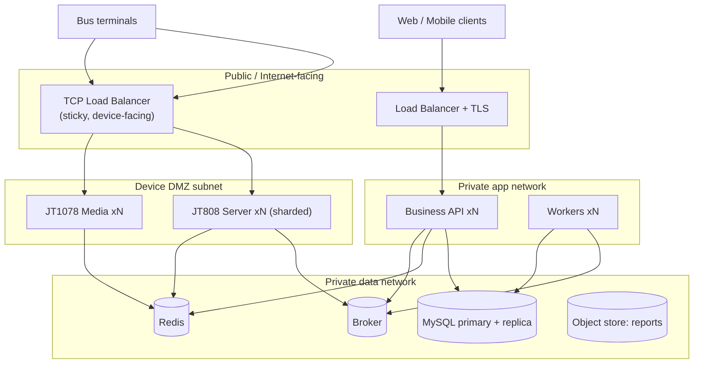

### 11.3 Deployment specifics

- **Client plane** behind HTTPS LB/WAF; **device plane** behind a **TCP load balancer with sticky routing** (JT808 needs persistent connections; JT1078 needs stable, publicly reachable host:port and UDP where used) in an isolated **device DMZ**.
- **Data plane** on a private network, never internet-exposed. MySQL primary + replica; Redis; broker; object store.
- **Region:** host in a cloud region with good latency to the target market (East Africa / Middle East). Keep minors' PII/video-control data in-region to respect residency expectations (Phase-1 R6).
- **CI/CD:** build → test → scan → deploy pipeline; migrations run as gated steps.
- **Observability:** centralized logs, metrics, health checks, and alerting (Phase-1 gap) for API latency, device-connection counts, event-bus lag, stream concurrency, and payment callbacks.
- **Backup/DR:** automated MySQL backups + point-in-time recovery; documented RPO/RTO targets; Redis is treated as reconstructable hot state.

---

## 12. Security Architecture

### 12.1 Authentication
JWT access + refresh; Argon2/bcrypt password hashing; refresh-token rotation and revocation (Redis). Account recovery / password reset flow (Phase-1 gap) included. **MFA recommended for privileged roles** (Founder, Regional Manager, Org Admin).

### 12.2 Authorization (RBAC)
Central permission matrix; least-privilege by default (brief 11.10). Endpoint-level permission dependencies + domain policies for sensitive actions (video access, billing operations, cross-region access).

### 12.3 Tenant isolation
`organization_id` enforced at the repository layer *and* the authorization layer; region scoping for Regional Managers; no cross-tenant joins. Isolation is defense-in-depth, not a single check.

### 12.4 Transport & data protection
HTTPS/TLS everywhere on the client plane; encryption at rest for the database and backups; PII of minors (location + identity) handled under a **GDPR-style baseline** for retention and consent (Phase-1 R6) even where local law is silent, to avoid a costly retrofit.

### 12.5 Video privacy enforcement (D5)
- Parent role has **no** video capability in the permission matrix and **no** reachable video endpoint or media-session issuance path.
- Live video / playback restricted to Org Admin (and explicitly-permitted RAAD staff).
- Every video session open/close is written to the audit log with actor, device, camera, and time.

### 12.6 Safety-over-billing invariant (D4)
A domain **capability policy** distinguishes *safety* capabilities (live GPS during active trips, trip-lifecycle + geofence safety notifications) from *premium* capabilities. Subscription status can toggle premium capabilities only; safety capabilities are **unconditionally granted** while a trip is active. This is a single, tested policy object — not scattered `if subscription_active` checks — so it cannot be accidentally bypassed.

### 12.7 Device-plane security
Device registration/auth keys; rejection + audit of unknown devices; IP/APN allow-listing where the operator supports it; isolated device DMZ; heartbeat/traffic anomaly detection; TLS on device links where terminals support it. (JT808/JT1078 native security is weak — these are compensating controls.)

### 12.8 Audit & compliance
Append-only, tamper-evident audit log for every important action (Ch. 7.13); defined retention; access to audit logs itself permission-gated.

---

## 13. Scalability Strategy

### 13.1 Proposed NFR targets (closing the Phase-1 "unquantified NFR" gap — for owner sign-off)

| Attribute | Proposed MVP target | Notes |
|-----------|---------------------|-------|
| Platform availability | 99.5% (→ 99.9% as it matures) | Excludes device/network outages outside RAAD's control |
| GPS position cadence | every 10–15 s active; 30–60 s idle | Configurable per device; sizes ingestion |
| Live-position end-to-end latency | ≤ 3–5 s device→client | Under normal mobile connectivity |
| Concurrent live video streams | Hard ceiling per org + global (e.g., start 50 global) | Protects bandwidth/CPU; raise with capacity |
| Position write throughput | Sized to (vehicles × cadence) with headroom | Drives DB/partition strategy |
| Concurrent users | Thousands (stateless API scales horizontally) | Per brief 10.2 |

*(Numbers are proposals to make the NFRs testable; please confirm or adjust.)*

### 13.2 Scaling levers by component

- **Business API:** stateless → add replicas behind the LB.
- **JT808 Server:** shard devices across nodes (hash on device-id); Redis session registry shared; add shards as fleet grows.
- **JT1078 Media:** add media nodes; scale by concurrent-stream ceiling; enforce back-pressure/queueing.
- **Data:** Redis for hot reads; partition positions by time; add read replicas; migrate positions to a TSDB; consider tenant/region sharding at large scale.
- **Event bus:** Redis Streams/RabbitMQ → **Kafka** for the telemetry firehose; contracts are broker-agnostic.
- **Workers:** scale horizontally per queue.

### 13.3 Evolution roadmap (monolith → services)

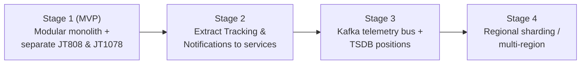

Extraction order is driven by load: the telemetry/tracking and notification contexts are the first to leave the monolith because they carry the highest, spikiest volume. Because module seams and event contracts already exist, each extraction is a move, not a rewrite.

---

## 14. Future Expansion Strategy (scope-safe)

**Principle:** design *extension seams* now; build *nothing* beyond the school-bus MVP (D1–D3, and the `CLAUDE.md` no-ERP charter).

Seams intentionally present but dormant:

- **`org_type` on Organization** — enables a future commercial-fleet/employee-transport variant without reshaping the core (D3 keeps it dormant).
- **Boarding-event seam** — the trip/notification model can later ingest `BoardingEvent`s from RFID/NFC/QR/AI capture (D1) without changing trip lifecycle.
- **Notification-channel abstraction** — SMS/Email/WhatsApp adapters can register later behind the same interface (D2 keeps only FCM active).
- **Payment-provider abstraction** — Zaad, Sahal, eDahab, bank/international providers plug into the same provider interface as EVC Plus (brief 11.11).
- **Additional roles** (Fleet Supervisor, Dispatcher, etc., Ch. 4.9) fit the existing RBAC matrix.
- **Analytics/AI** (driver behavior, predictive maintenance, ETA/route optimization, Ch. 3.4) consume the existing event/telemetry streams as a downstream context — added later, never in MVP.
- **Microservice extraction & multi-region** per §13.

**Explicitly out (guardrails):** classroom/school attendance, payroll, exams/gradebook, LMS, general school finance/ERP. Any request pulling toward these is flagged, not built.

---

## 15. Key architecture decisions (ADR summary)

| ID | Decision | Rationale |
|----|----------|-----------|
| ADR-1 | Modular monolith for business logic; separate device/media services | Simplicity now, clean extraction later; separation only where runtime concerns truly differ (D6) |
| ADR-2 | Dedicated JT808 TCP + JT1078 media planes; FastAPI never touches device sockets | Protocol reality; the Phase-1 P0 contradiction (D6) |
| ADR-3 | Event-driven backbone with transactional outbox | Reliable device→business→notification flow |
| ADR-4 | Shared-schema multi-tenancy + centralized tenant filter, with a hardening seam | Cost/simplicity at MVP while meeting strict isolation |
| ADR-5 | Redis latest-position + partitioned positions table, TSDB as scale path | Real-time reads + bounded write growth |
| ADR-6 | Safety-capability policy separate from billing entitlements | Encodes D4 as an un-bypassable invariant |
| ADR-7 | Video authorization gated in the API, parents excluded by construction | Encodes D5; auditable |
| ADR-8 | FCM + in-app only, behind a channel abstraction | Encodes D2 with a future seam |
| ADR-9 | Vendor-adapter ACL for JT808/JT1078 dialects | Real vendor independence (Phase-1 R8) |

---

## 16. Open items for owner confirmation (non-blocking)

1. **NFR targets in §13.1** — confirm or adjust the proposed numbers so the architecture is validated against agreed targets.
2. **MVP scale inputs** — expected orgs / vehicles / peak concurrent live streams (right-sizes DB, gateway sharding, and the video ceiling).
3. **Position retention window** — the recommended 90-day raw retention (trip summaries long-term) — confirm.
4. **Data-residency baseline** — confirm the GDPR-style baseline and preferred hosting region.
5. **MFA for privileged roles** — confirm inclusion in MVP.

None of these block progress; sensible defaults are already baked in.

---

*End of Phase 2 core architecture. This is design documentation only — no implementation code was produced.*

---

# Phase 2 — Architecture Addendum (v1.1)

**Added:** 2026-07-10 — appended, not a rewrite. Extends the architecture with regional/organization hierarchy, device assignment lifecycle, the parent EVC Plus payment workflow, formal device and geofence event models, and the tracking visibility rules. All prior decisions (D1–D6) and the no-ERP scope charter remain in force.

**Requirements this addendum satisfies:**
- Parent tracking only during active trips.
- Organization Admin tracks buses 24/7.
- RAAD Regional Managers only see their assigned regions.
- Device assignment supports changing drivers without changing devices.

---

## 17. Regional Management Hierarchy

### 17.1 Purpose

Formalizes the RAAD-internal (platform-side) org structure and the region-scoping that bounds Regional Managers and Support Staff. This sits *above* customer organizations — it is how RAAD staff are granted access to subsets of customers.

### 17.2 Hierarchy

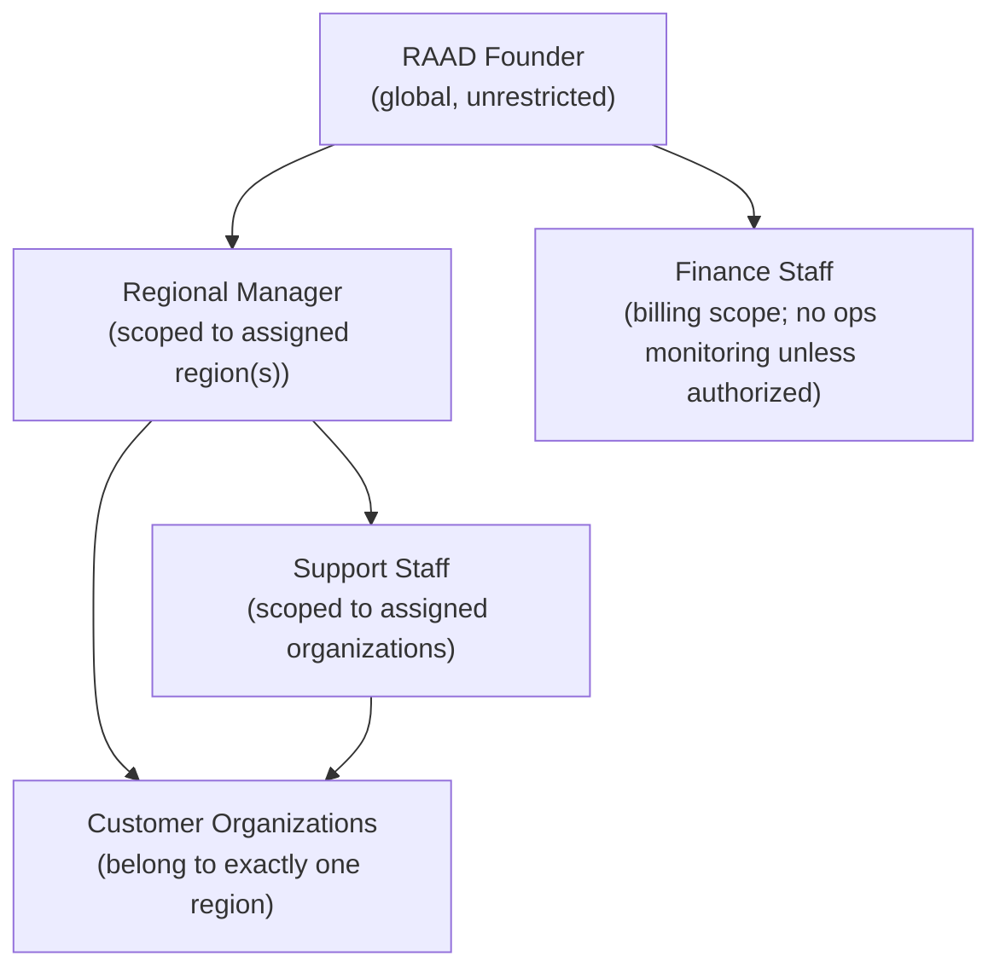

### 17.3 Model

- **`Region`** is a first-class entity: `{region_id, name, geographic_scope, status}`. Every customer `Organization` belongs to exactly one region (`organization.region_id`).
- **`RegionAssignment`** binds a Regional Manager (or Support Staff) to one or more regions/organizations: `{user_id, region_id | org_id, granted_by, granted_at}`. A Regional Manager may cover more than one region; Support Staff are assigned to specific organizations *within* a region.
- **Founder** has no region binding — implicit global scope.
- **Finance Staff** have a *billing* scope that may span regions (for revenue/invoicing) but are **denied operational monitoring** unless an explicit grant exists (Ch. 4.5).

### 17.4 Access enforcement (the region scope filter)

Region scoping is a **second scope filter layered on top of** the tenant filter (§12.3), applied for RAAD-staff principals:

```
effective_org_scope(user) =
  Founder            → ALL organizations
  RegionalManager    → organizations WHERE region_id ∈ user.assigned_regions
  SupportStaff       → organizations WHERE org_id ∈ user.assigned_orgs
  FinanceStaff       → billing data only; ops monitoring only if explicitly granted
```

Every query issued by a RAAD-staff user is intersected with `effective_org_scope`. A Regional Manager physically cannot load an organization outside their region — the scope is applied at the repository layer, not just hidden in the UI (satisfies "Regional Managers only see their assigned regions"). All cross-scope attempts are audited.

### 17.5 Notes

- Reassigning a region (e.g., moving an org to a new region) is an audited platform operation; historical audit entries retain the region at time of action.
- This hierarchy is **platform-internal** and distinct from the *customer* org hierarchy in §18.

---

## 18. Organization Hierarchy

### 18.1 Purpose

Supports customers that are **transport operators managing multiple schools/branches** (a target customer per Ch. 1.3 and problem 2.4 "Managing multiple schools from one platform"), while keeping the default single-organization case simple. Stays strictly within the school-transport scope (D3).

### 18.2 Two-level model (with a dormant deeper seam)

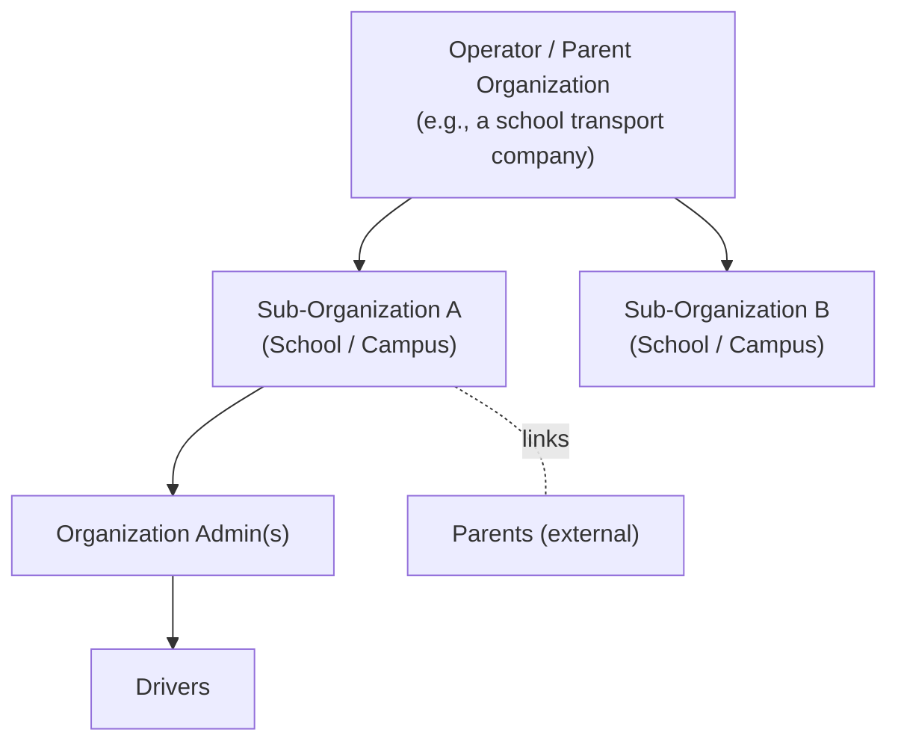

- **`Organization.parent_org_id`** (nullable, self-referential) enables an operator → sub-organization (campus/branch) relationship. When null, the org is a standalone tenant (the common case).
- **Tenant isolation boundary** remains at the **top of the hierarchy**: an operator and its sub-organizations form one isolation domain; data never crosses to a *different* operator. Within the domain, sub-org scoping restricts a campus admin to their campus.
- **MVP guidance:** ship the flat single-organization case first; the `parent_org_id` seam is present so the multi-campus operator model activates later **without a schema reshape** — no premature complexity (aligns with "avoid unnecessary complexity").

### 18.3 Internal org roles

- **Organization Administrator** — full operations within their org (or sub-org): students, parents, drivers, vehicles, devices, routes, stops, trips, transport payments, reports, settings (Ch. 4.6). An operator-level admin may be scoped across sub-orgs; a campus-level admin to one sub-org.
- **Driver** — operational, assigned-vehicle only (Ch. 4.7).
- **Parent** — external stakeholder, own-children only (Ch. 4.8); not an internal org user.

### 18.4 Scoping rule

```
org_admin_scope(user) =
  operator-level admin → self org + all sub-orgs (WHERE parent_org_id = self.org_id OR org_id = self.org_id)
  campus-level admin   → self org only
```

Applied on top of the tenant filter; combined with §17 for RAAD staff who view these orgs.

---

## 19. Device Assignment Lifecycle

### 19.1 The decoupling principle (core requirement)

**A device is bound to a *vehicle*, never to a *driver*.** Driver assignment lives entirely in Transport Operations and is expressed through **trips**. Therefore **changing the driver of a vehicle never touches the device↔vehicle binding** — the requirement "changing drivers without changing devices" is satisfied by construction.

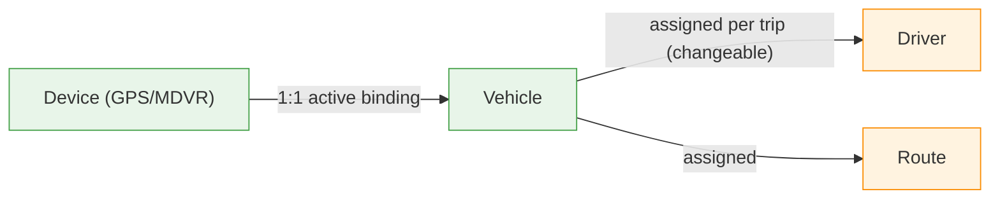

The **stable** binding (device↔vehicle) and the **fluid** binding (vehicle↔driver, per trip) are independent lifecycles. Swapping a driver is a Transport-Ops operation; it emits no device event and requires no device reconfiguration.

### 19.2 Device assignment lifecycle states

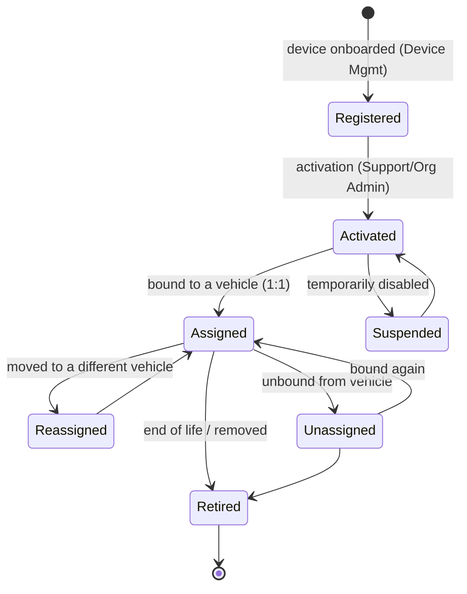

- **`DeviceAssignment`** record: `{device_id, vehicle_id, assigned_by, assigned_at, unassigned_at}`. Only one row is *active* (`unassigned_at IS NULL`) per device and per vehicle at a time (enforces "one device ↔ one vehicle" and "one vehicle ↔ one active device", Ch. 7.4/7.5). History is retained for audit and reporting.
- **Reassignment flow** (device → new vehicle): close the current active assignment, open a new one, re-resolve the JT808 session's `device→vehicle→org` mapping in Redis so subsequent positions attribute to the new vehicle. Emits `DeviceReassigned`.
- **Driver change flow** (the requirement): update the vehicle↔driver assignment (or simply assign a different driver to the next trip). **No device transition occurs**; the device stays `Assigned` to the same vehicle throughout.

### 19.3 Interaction with connectivity

Assignment lifecycle (business state) is orthogonal to connectivity state (runtime). A device can be `Assigned` and `Offline` simultaneously; see the combined device state machine in §21.

---

## 20. Parent EVC Plus Payment Workflow

> **Scope note:** this section *designs the workflow*; it does not process payments. RAAD never handles raw card/bank credentials — mobile-money confirmation (PIN entry) happens on the payer's own phone via the provider, and RAAD only receives tokens/status. Per D4, none of this gates safety tracking.

### 20.1 Where it applies

Applies to the **Parent-Pays** billing model (Ch. 9.2), where a parent subscribes for app access. The design is **provider-agnostic** behind a payment-provider interface; **EVC Plus** is the first adapter, with Zaad/Sahal/eDahab/bank/international providers as future adapters (brief 11.11). Renewal happens **in-app without leaving the application** (brief 11.11).

### 20.2 Workflow

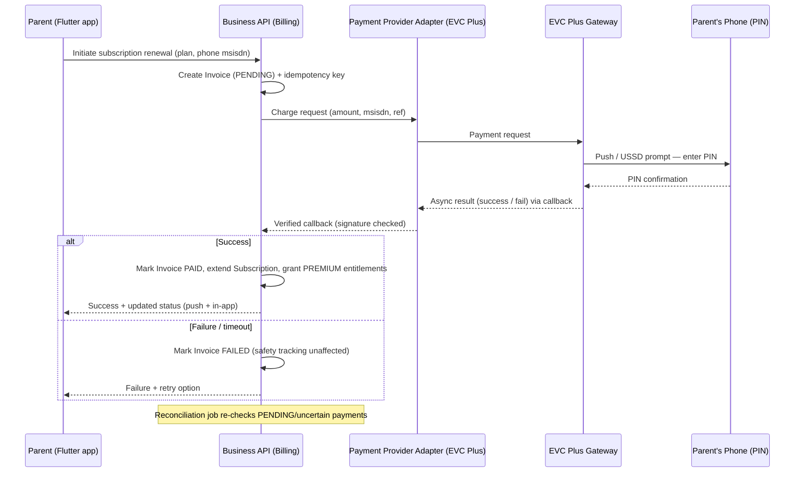

### 20.3 Payment state machine

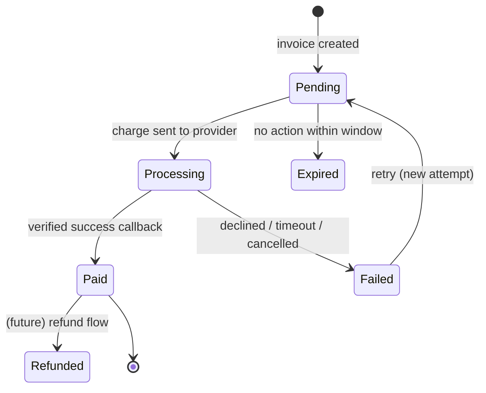

### 20.4 Reliability & correctness (Phase-1 R7)

- **Idempotency:** every charge carries an idempotency key; duplicate submits (double-tap, ret/retry) never double-charge or double-extend.
- **Webhook/callback verification:** provider callbacks are signature/secret-verified; unverified callbacks are rejected and audited. Callbacks are treated as untrusted input.
- **Reconciliation job:** a scheduled worker re-queries provider status for `Pending/Processing` payments that lack a terminal callback (handles lost webhooks), and settles them.
- **Timeouts & retries:** bounded wait for confirmation; clear in-app state; safe retry that reuses the idempotency key.
- **Audit:** every state transition and callback is written to the audit log with amount, msisdn (masked), ref, and actor.

### 20.5 Safety invariant (D4)

Payment outcome affects **premium/convenience entitlements only** (e.g., live-video visibility where an org enables it — though for parents video is off by construction, D5 — extended history, etc.). **A `Failed`, `Expired`, or lapsed parent subscription never disables live GPS during active trips or safety notifications.** Enforced by the safety-capability policy (§12.6), not at the payment call site.

### 20.6 Separation of transport fees vs subscription

Consistent with Ch. 7.12, **transport fees** (paid to the organization) are tracked separately from **platform subscription** (Parent-Pays or Org-Pays). The payment workflow above governs subscription; transport-fee status is a distinct record surfaced to parents/admins for information.

---

## 21. Device State Machine (combined lifecycle + connectivity)

A device has **two orthogonal state dimensions**, tracked independently: a **business lifecycle** state (§19.2) and a **runtime connectivity** state driven by the JT808 session.

### 21.1 Connectivity (runtime) state

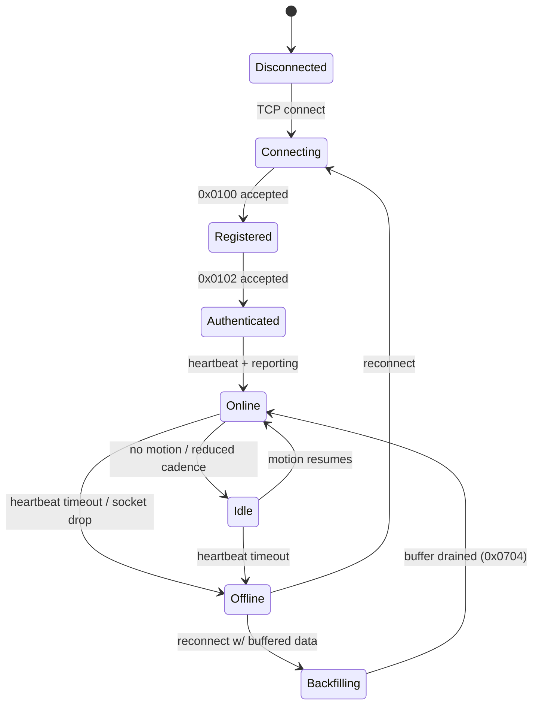

- **Online/Offline** derive from heartbeat and reporting timeouts; transitions emit `DeviceOnline` / `DeviceOffline` events used by device-status monitoring, alarms, and exception workflows (Ch. 8.9).
- **Backfilling** is the reconnect-with-buffered-data path (§5.1): buffered positions ingest with original timestamps and `backfill=true`, feeding history without polluting the live view.
- **Idle** models reduced cadence when a vehicle is stationary (ties to the configurable GPS cadence in §13.1).

### 21.2 How the two dimensions combine

| Lifecycle (§19.2) | Connectivity (§21.1) | Meaning |
|-------------------|----------------------|---------|
| Assigned | Online | Normal operating device on a vehicle |
| Assigned | Offline | Vehicle's device unreachable (network/power); alarm + monitoring |
| Activated (not Assigned) | Offline | Provisioned but not yet on a vehicle |
| Suspended | (any) | Administratively disabled; connections rejected/ignored |
| Retired | Disconnected | Decommissioned |

A device transitioning to `Offline` while `Assigned` during an *active trip* is an operational event: it surfaces to the Org Admin monitor and can flag the trip toward the `Interrupted` state (§6.2) per policy.

---

## 22. Geofence Event Architecture

### 22.1 Geofence types

- **Stop geofence** — a radius around each `Stop` (pickup/drop-off). Used for "approaching" and "arrived at stop" semantics.
- **Organization geofence** — a radius around the organization/campus. Used for "arrived at organization" (end-of-pickup / start-of-drop-off).
- **(Future seam)** route-corridor geofence for off-route detection — dormant, not built in MVP.

Radii and the **approach threshold** (distance or ETA) are **configurable per organization/route** (closes the Phase-1 "approaching" ambiguity).

### 22.2 Evaluation architecture

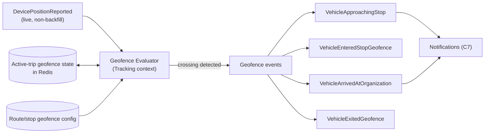

- The evaluator only runs for **active trips** (aligns with visibility rules §23 and avoids wasted computation). When a trip starts, its route's stop geofences + the org geofence are loaded into per-trip state in Redis; when it ends, they're cleared.
- Each incoming **live** position (backfilled points are excluded to prevent false historical triggers) is tested against the *upcoming* stops for that trip and the org geofence.

### 22.3 Correctness controls

- **Hysteresis / debounce:** entering a radius fires `Entered` once; a vehicle lingering or GPS jitter near the boundary does not re-fire (enter/exit tracked with a state flag + minimum dwell).
- **Sequence awareness:** "approaching" fires for the *next* assigned stop in route order, not stops already passed.
- **Cooldown:** duplicate suppression window per (trip, stop, event-type).
- **Recipient scoping** (via C7): "approaching your stop" reaches only the parents whose child is assigned to that stop; "arrived at organization" and trip-lifecycle events follow the trip's roster and the org admin.

### 22.4 Event → notification mapping (MVP, no boarding — D1)

| Geofence/trip event | Notification | Recipients |
|---------------------|--------------|-----------|
| TripStarted | Morning/Afternoon Trip Started | Assigned parents + Org Admin |
| VehicleApproachingStop | Bus approaching your stop | Parents of children at that stop |
| VehicleArrivedAtOrganization | Arrived at organization | Assigned parents + Org Admin |
| TripEnded | Trip Completed | Assigned parents + Org Admin |

---

## 23. Tracking Visibility Rules

### 23.1 The visibility matrix

Visibility is governed by four independent dimensions that are **AND-ed** together: **role capability**, **org/region scope**, **ownership** (whose data), and **time window** (active trip vs anytime).

| Role | Live GPS | Time window | Data scope | Live video / playback |
|------|----------|-------------|------------|------------------------|
| **Parent** | Yes | **Active trips only** | Own children's assigned vehicle, that trip only | **No (never)** — D5 |
| **Organization Admin** | Yes | **24/7 continuous** | All vehicles in own org (+ sub-orgs if operator-level, §18) | **Yes** (own org) — D5 |
| **Driver** | Yes | Own active trip | Own assigned vehicle | No |
| **RAAD Founder** | Yes | 24/7 | All organizations (global) | Yes (governed/audited) |
| **RAAD Regional Manager** | Yes (oversight, read-only) | 24/7 | **Only organizations in assigned region(s)** — §17 | Only if explicitly permitted; audited |
| **RAAD Support Staff** | Yes (read-only) | 24/7 | Only assigned organizations | Only if explicitly permitted; audited |
| **RAAD Finance Staff** | **No** (ops monitoring denied by default) | — | Billing scope | No |

### 23.2 Enforcement mechanics

- **Parent time-boundedness is enforced, not cosmetic.** A parent's WebSocket subscription to a vehicle's live positions is authorized **only while that vehicle has an active trip carrying the parent's child**. On `TripStarted`, the parent's live channel for that vehicle opens; on `TripEnded`, it is closed server-side and further position frames are not delivered. REST live-position reads apply the same active-trip + ownership check. Outside active trips, parents get **history only** (Ch. 7.8/7.10).
- **Org Admin 24/7** is a continuous capability over all org vehicles (Ch. 7.10) — no time gate — bounded by the tenant (and sub-org) scope.
- **Regional Manager region scope** is the §17 `effective_org_scope` filter applied to every tracking/monitoring query and socket subscription — a manager cannot subscribe to a vehicle outside their region.
- **Video** follows D5 unconditionally: the Parent and Driver roles have no video capability or reachable media path; Org Admin (and explicitly-permitted RAAD staff) only, every session audited (§12.5).
- **Safety-over-billing (D4):** the parent live-GPS-during-active-trip capability is a **safety** capability and is never revoked by subscription lapse; only premium extras are gated (§12.6).

### 23.3 Decision flow for "can user X see live position of vehicle V now?"

```mermaid
flowchart TD
  A["Request: live position of V"] --> B{Role has live-GPS capability?}
  B -- No --> DENY["Deny"]
  B -- Yes --> C{V within user's org/region scope?}
  C -- No --> DENY
  C -- Yes --> D{Ownership OK?\n(parent: own child on V)}
  D -- No --> DENY
  D -- Yes --> E{Time window OK?\n(parent: V has active trip;\nadmin/staff: always)}
  E -- No --> DENY
  E -- Yes --> ALLOW["Allow live stream"]
```

This single predicate — capability ∧ scope ∧ ownership ∧ time-window — is the authoritative rule for every live-tracking surface (web, mobile, WebSocket, REST).

---

*End of Addendum v1.1. Design documentation only — no implementation code produced. Awaiting your review.*

