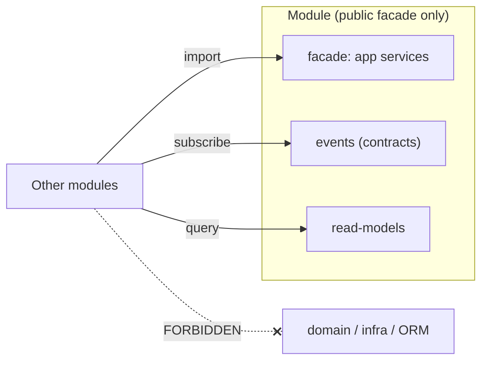
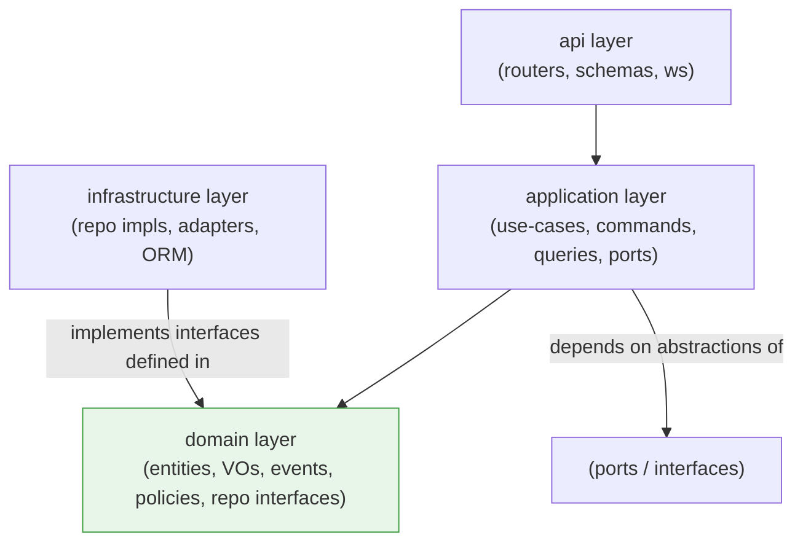
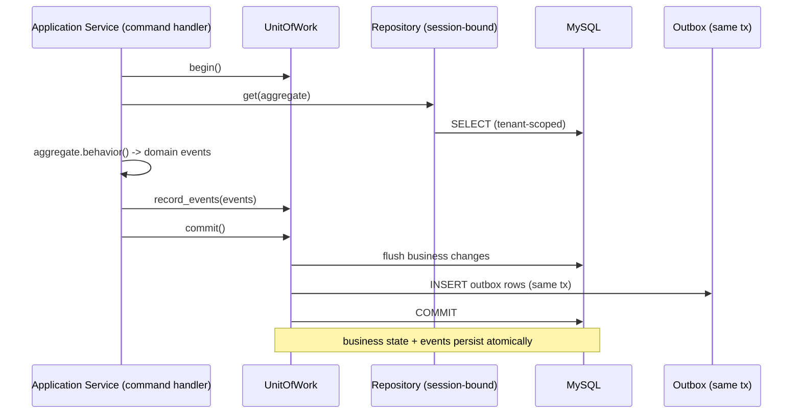
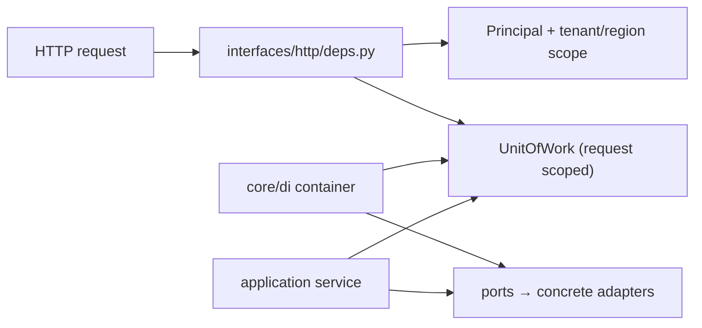
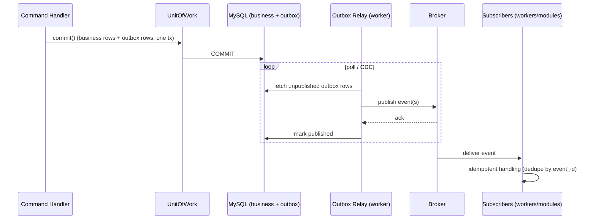
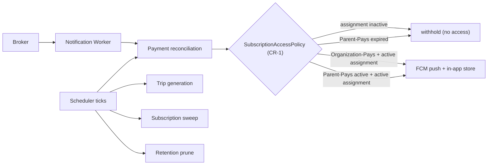
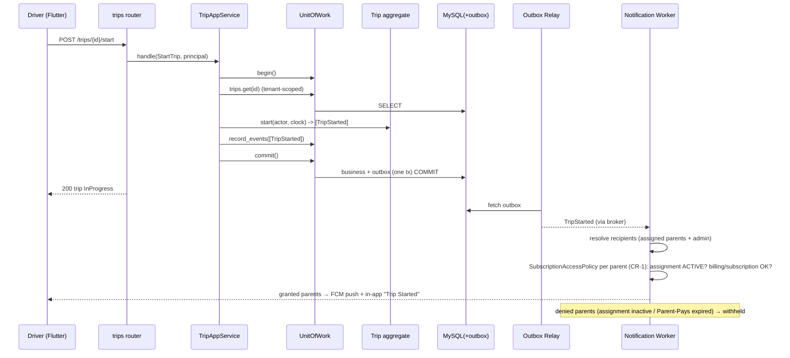
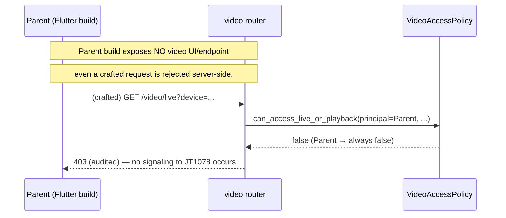

# RAAD Platform — Phase 3.1: Detailed Backend Technical Design (LLD)

**Prepared by:** Senior Enterprise Software Architect
**Phase:** 3.1 — Backend Low-Level Design (design documentation only; **no implementation code**)
**Scope of this document:** the **Business API** deployable (the FastAPI modular monolith) and its worker runtime **only**. The JT808 and JT1078 services have their own LLDs in later Phase-3 subsystems and are referenced here only at their integration seams.
**Traceability:** every decision derives from the approved Phase-2 Architecture (§ references throughout) and the locked decisions **D1–D6**. No new business requirements are introduced.

> **Revision — CR-1 (2026-07-10):** During Backend LLD review, the subscription/access business rule was changed. **`SubscriptionAccessPolicy` supersedes `SafetyCapabilityPolicy`, revising decision D4.** Parent access is now governed by the approved subscription business models (Parent-Pays / Organization-Pays) plus a mandatory active-student-assignment gate. Sections **0, 5, 11, 16, 17, 18, 19** are updated; the rest of the architecture is unchanged. *Note: the Phase-2 architecture document still references the former D4 in §6.5, §12.6, §20.5, §23.2, ADR-6 — those need a matching follow-up update (not done here, per the "only modify the Backend LLD" instruction).*

> **Notation for contracts.** Interfaces below are shown as **language-neutral contract skeletons** — signatures and responsibilities only, **no method bodies / no logic**. They are design artifacts, not implementation. Real code is out of scope for this phase.

---

## 0. Design invariants carried from Phase 2

| Ref | Invariant honored by this LLD |
|-----|-------------------------------|
| D1 | No boarding logic; notification triggers are trip-lifecycle + geofence only. |
| D2 | One outbound notification channel adapter (FCM) + in-app store, behind a channel-abstraction seam. |
| D3 | School-transport domain only; `org_type` seam present, dormant. |
| ~~D4~~ → **CR-1** | **`SubscriptionAccessPolicy`** is a first-class domain policy governing **all Parent access**: Parent-Pays expiry blocks access (redirect to payment); Organization-Pays grants access with no payment page; an **active student-assignment is required in all cases** and overrides subscription status. Supersedes the former "safety-never-gated" rule. |
| D5 | **Video-access policy**: Parent/Driver roles have no video capability and no reachable media path; Org Admin (+ permitted RAAD staff) only. |
| D6 | Business API never opens a device socket; it talks to JT808/JT1078 via signaling/commands over the event/RPC seam. |
| §3 | Modular monolith; strict module seams; extraction-ready. |
| §7.2 | Tenant context auto-applied at repository layer; transactional outbox for events. |

---

## 1. Complete Backend Folder Structure

The Business API is one deployable, one Python package (`raad`), organized by **bounded context module** (Phase-2 §2.1/§3). Structure is presented as a design tree.

```
raad_business_api/
├── pyproject.toml                # dependency + tool config (design-time)
├── alembic.ini                   # migration config (DB design is Phase 3.2 — placeholder only)
├── raad/
│   ├── main.py                   # ASGI app factory & composition root wiring (no business logic)
│   │
│   ├── core/                     # cross-cutting shared kernel (see §17)
│   │   ├── config/               # settings, environment profiles, feature flags
│   │   ├── security/             # jwt, password hashing, rbac matrix, permissions
│   │   ├── tenancy/              # tenant + region scope context, scope resolver
│   │   ├── db/                   # engine, session factory, declarative base, UoW
│   │   ├── events/               # event base types, outbox, in-proc dispatcher, bus port
│   │   ├── errors/               # exception hierarchy + HTTP mapping
│   │   ├── logging/              # structured logging, context binding, PII redaction
│   │   ├── validation/           # shared validators, guard helpers (contracts)
│   │   ├── pagination/           # page/limit/cursor primitives
│   │   ├── policies/             # base policy abstractions (safety, video, access)
│   │   ├── time/                 # clock port (testable time)
│   │   ├── ids/                  # id generation strategy (uuid/ulid) port
│   │   └── di/                   # container / provider registry (composition root)
│   │
│   ├── modules/
│   │   ├── iam/                  # C1 Identity & Access
│   │   ├── organization/         # C2 Organization / Tenant (+ region, hierarchy)
│   │   ├── fleet_device/         # C3 Fleet & Device (device assignment lifecycle)
│   │   ├── transport_ops/        # C4 Students, Parents, Routes, Stops, Trips
│   │   ├── tracking/             # C5 Telemetry ingest (from device plane), geofence, live state
│   │   ├── video/                # C6 Video session control (authz + signaling only)
│   │   ├── notifications/        # C7 Notification rules, FCM + in-app
│   │   ├── billing/              # C8 Subscription, invoices, EVC Plus workflow
│   │   ├── reporting/            # C9 Reports & exports
│   │   └── platform_audit/       # C10 Audit log, system settings, integrations
│   │
│   ├── interfaces/               # delivery mechanisms (composition of modules)
│   │   ├── http/
│   │   │   ├── api_v1.py         # v1 router aggregation
│   │   │   ├── deps.py           # shared FastAPI dependencies (auth, tenant, UoW, pagination)
│   │   │   ├── middleware.py     # request-id, logging, error envelope, rate-limit hooks
│   │   │   └── ws.py             # WebSocket endpoints (live positions, live notifications)
│   │   └── workers/
│   │       ├── outbox_relay.py   # publishes outbox → broker
│   │       ├── notification_worker.py
│   │       ├── scheduler.py      # trip generation, subscription sweeps, retention, reconciliation
│   │       └── report_worker.py
│   │
│   └── shared_contracts/         # cross-module event & DTO contracts (schemas only)
│       ├── events/               # published domain-event schemas (versioned)
│       └── read_models/          # cross-context read DTOs (query-only)
│
├── migrations/                   # Alembic revisions (authored in Phase 3.2)
└── tests/
    ├── unit/                     # domain + application (no I/O)
    ├── integration/              # repositories, adapters (with test DB)
    ├── contract/                 # event/DTO schema contract tests
    └── architecture/             # import-boundary / dependency-direction tests
```

Each **module** has the identical internal shape (design tree):

```
modules/<context>/
├── api/
│   ├── routers.py            # FastAPI routers (thin; delegate to application services)
│   ├── schemas.py            # request/response DTOs (Pydantic) — transport contracts
│   └── ws.py                 # (only where the module serves realtime, e.g., tracking)
├── application/
│   ├── services.py           # use-case / command & query handlers (orchestration)
│   ├── commands.py           # command DTOs (intent)
│   ├── queries.py            # query DTOs
│   └── ports.py              # outbound ports the app layer needs (interfaces)
├── domain/
│   ├── entities.py           # entities & aggregate roots (contracts + invariants)
│   ├── value_objects.py
│   ├── events.py             # domain events emitted by this context
│   ├── services.py           # domain services (pure)
│   ├── policies.py           # context-specific policies
│   └── repositories.py       # repository INTERFACES (owned by domain)
├── infra/
│   ├── models.py             # ORM models (persistence mapping) — Phase 3.2 finalizes columns
│   ├── repositories.py       # repository IMPLEMENTATIONS (SQLAlchemy async)
│   ├── adapters.py           # external adapters (FCM/payment/maps/device signaling) as needed
│   └── mappers.py            # ORM<->domain mapping
├── events/
│   ├── publishers.py         # maps domain events → outbox records
│   └── subscribers.py        # this module's reactions to others' events
└── __init__.py               # module facade: the ONLY public surface (see §2)
```

**Rationale (§19 preview):** a uniform per-module skeleton makes the codebase navigable, makes the dependency rules mechanically checkable, and makes later service extraction (Phase-2 §13) a directory move rather than a redesign.

---

## 2. Internal Module Boundaries

### 2.1 The module facade (public vs private)

Each module exposes a **single public surface** via its `__init__.py` facade: a small set of **application services**, its **published event schemas** (in `shared_contracts/events`), and **query read-models**. Everything else (`domain`, `infra`, ORM models, repositories) is **private** and must not be imported by other modules.

```
Public surface of a module =
  { application services (facade),
    published domain-event contracts,
    query read-models }
Private (never imported cross-module) =
  { entities, value objects, ORM models, repositories, mappers, infra adapters }
```

### 2.2 Boundary rules (enforced, not aspirational)

1. **No cross-module imports of `domain/` or `infra/`.** A module may import another module's **facade** (application service interface) or subscribe to its **events**.
2. **No cross-module database access.** A module reads/writes only its own tables. Data owned elsewhere is obtained via the owning module's service (sync) or via events/read-models (async).
3. **Communication styles:**
   - *Synchronous, in-process* — for a request that legitimately needs another context's data now (e.g., Transport-Ops asks IAM to authorize). Done via the target's application-service **port**, resolved by DI.
   - *Asynchronous, via events* — for reactions and side-effects (e.g., Tracking emits `VehicleApproachingStop`; Notifications reacts). Preferred to keep modules decoupled.
4. **Contracts are versioned.** Event and cross-module DTO schemas live in `shared_contracts/` and are versioned; a breaking change is a new version, not an edit.

### 2.3 Enforcement mechanism

An **architecture test suite** (`tests/architecture/`) asserts the import graph: it fails the build if any module imports another module's private packages, or if `domain` imports `infra`/FastAPI. This turns the boundary from convention into a gate.



---

## 3. Dependency Direction

### 3.1 The rule

Dependencies point **inward** toward the domain (Dependency Inversion). The domain defines interfaces; infrastructure implements them.



- **`domain`** depends on **nothing** external — no FastAPI, no SQLAlchemy, no network. Pure Python (types + rules).
- **`application`** depends on `domain` and on **ports** (interfaces), never on concrete infra.
- **`infra`** depends on `domain` (to implement its interfaces) and on frameworks/drivers.
- **`api`** depends on `application` (and DTOs), never on `infra` directly.
- **Composition root** (`core/di`, `main.py`) is the *only* place that knows concrete infra and wires it to interfaces.

### 3.2 Why (rationale)

This keeps business rules testable in isolation (no DB/network to run domain tests), allows the persistence store to change (Phase-2 §10.3 positions→TSDB path) without touching business logic, and makes module extraction safe because the domain has no framework entanglement.

---

## 4. Application Layer

### 4.1 Responsibility

The application layer implements **use-cases** as command/query handlers. It **orchestrates**: loads aggregates via repositories, invokes domain behavior, enforces cross-aggregate coordination, manages the **transaction boundary** (Unit of Work, §8), and **records domain events** for post-commit publication (§10). It contains **no business rules** — those live in the domain — and **no I/O details** — those live in infra behind ports.

### 4.2 Shape (contract skeleton — no implementation)

```
# application/commands.py  (intent DTOs)
Command StartTrip { trip_id, driver_id, actor: Principal }
Command AssignDeviceToVehicle { device_id, vehicle_id, actor }
Command RenewParentSubscription { parent_id, plan_id, msisdn, actor }

# application/ports.py  (outbound interfaces the use-case needs)
interface UnitOfWork            # see §8
interface EventRecorder         # collect domain events for outbox
interface Clock                 # current time (testable)
interface DeviceCommandPort     # → JT808 service (D6 seam)
interface VideoSignalingPort    # → JT1078 service (D6 seam)
interface PaymentProviderPort   # → EVC Plus adapter
interface PushSenderPort        # → FCM

# application/services.py  (use-case handlers — signatures only)
service TripAppService:
    handle(StartTrip) -> TripStartedResult          # loads Trip aggregate, calls domain, commits, records TripStarted
    handle(EndTrip)   -> TripEndedResult

service DeviceAppService:
    handle(AssignDeviceToVehicle) -> AssignmentResult
    handle(ReassignDevice)        -> AssignmentResult
    handle(ChangeVehicleDriver)   -> DriverChangeResult   # NEVER touches device binding (Phase-2 §19)
```

### 4.3 Transaction & event ordering (mandatory pattern)

Every command handler follows the same skeleton (described, not coded):

1. Resolve **Principal** + **tenant/region scope** (already injected).
2. Open **Unit of Work**.
3. Load aggregate(s) via **repository** (tenant-scoped).
4. Invoke **domain** behavior (which enforces invariants and returns domain events).
5. **Record** those events into the UoW's event buffer.
6. **Commit** UoW → the DB write and the **outbox** rows persist atomically (§10).
7. Return a result DTO. Publication to the broker happens **after** commit via the outbox relay.

### 4.4 Rationale

Thin, uniform application services keep controllers dumb and domain pure, make authorization and transaction handling consistent, and guarantee the **event-after-commit** property that the whole event-driven backbone (Phase-2 §6) relies on.

---

## 5. Domain Layer

### 5.1 Contents

- **Entities & Aggregate Roots** — identity + lifecycle + invariants. Aggregate roots are the only entry points for mutation (e.g., `Trip`, `DeviceAssignment`, `Subscription`, `Organization`).
- **Value Objects** — immutable, equality-by-value (e.g., `GeoPoint`, `Msisdn`, `Radius`, `Money`, `RegionScope`).
- **Domain Services** — stateless operations spanning entities where a method on one entity would be unnatural (e.g., geofence crossing evaluation primitives).
- **Domain Events** — facts emitted on state change (e.g., `TripStarted`, `DeviceReassigned`, `SubscriptionExpired`).
- **Policies** — encapsulated decision objects (the CR-1 `SubscriptionAccessPolicy` and the D5 `VideoAccessPolicy` live here as first-class types).
- **Repository Interfaces** — defined here, implemented in infra (§7).

### 5.2 Aggregate design (contract examples — no logic)

```
aggregate Trip:
    identity: trip_id
    state: status ∈ {Scheduled, InProgress, Interrupted, Completed}, vehicle_id, driver_id, route_id, started_at, ended_at
    invariants:
        - a Trip has exactly one vehicle, one driver, one route
        - status transitions follow the Phase-2 §6.2 state machine
        - only one InProgress trip per vehicle at a time (checked in application via repository guard)
    behavior (returns domain events, mutates state, enforces invariants):
        start(actor, clock) -> [TripStarted]
        end(actor, clock)   -> [TripEnded]
        interrupt(reason)   -> [TripInterrupted]

aggregate DeviceAssignment:
    identity: assignment_id
    state: device_id, vehicle_id, assigned_at, unassigned_at?
    invariants:
        - device bound 1:1 to a vehicle while active (Phase-2 §19)
        - reassignment closes prior active assignment before opening a new one
    NOTE: driver identity is NOT part of this aggregate (device≠driver, Phase-2 §19.1)

policy SubscriptionAccessPolicy:          # CR-1: supersedes SafetyCapabilityPolicy (revises D4)
    # Governs whether the PARENT role/app may access ANY parent feature
    # (live GPS, notifications, trip history — the whole parent surface).
    evaluate_parent_access(
        assignment_state,        # ACTIVE | REMOVED | TRANSFERRED | GRADUATED | DISABLED
        billing_model,           # ORGANIZATION_PAYS | PARENT_PAYS   (from the organization)
        subscription_state       # ACTIVE | EXPIRED | ...  (consulted only for PARENT_PAYS)
    ) -> AccessDecision
    # AccessDecision = { granted: bool, reason?, required_action ∈ {NONE, REDIRECT_TO_PAYMENT} }
    # decision order (assignment gate first — overrides everything):
    #   1. assignment_state != ACTIVE        -> DENY(reason=ASSIGNMENT_INACTIVE, action=NONE)
    #   2. billing_model == ORGANIZATION_PAYS -> GRANT   (parent never sees a payment page)
    #   3. billing_model == PARENT_PAYS:
    #        subscription ACTIVE              -> GRANT
    #        else                             -> DENY(reason=SUBSCRIPTION_EXPIRED,
    #                                                  action=REDIRECT_TO_PAYMENT)

policy VideoAccessPolicy:                 # D5 (unchanged)
    can_access_live_or_playback(principal, device, org_scope) -> bool
        # Parent, Driver → always false (no reachable path)
        # Org Admin (own org), permitted RAAD staff (in-scope) → true, audited
```

### 5.3 Purity rule & rationale

The domain imports **no** framework, ORM, or I/O. Consequences: domain unit tests run in-memory and fast; the two access-control decisions — **`SubscriptionAccessPolicy`** (CR-1) and **`VideoAccessPolicy`** (D5) — are **single, tested policy objects** rather than scattered `if` checks, so they cannot be bypassed by a forgotten call-site check (exactly the risk the Phase-1 review flagged).

### 5.4 `SubscriptionAccessPolicy` in detail (CR-1)

This policy replaces `SafetyCapabilityPolicy`. Where the former treated safety tracking as un-gateable, CR-1 makes **all Parent access** conditional on the subscription business model and a mandatory student-assignment gate.

**Inputs** (all resolved before the policy is called; the policy itself is pure):

- **`assignment_state`** — the state of the parent↔student transportation assignment: `ACTIVE`, or one of `REMOVED / TRANSFERRED / GRADUATED / DISABLED` (all treated as *inactive*).
- **`billing_model`** — the organization's chosen model (Ch. 9.2): `ORGANIZATION_PAYS` or `PARENT_PAYS`.
- **`subscription_state`** — the parent's subscription status; consulted **only** for `PARENT_PAYS`.

**Decision table** (assignment gate has highest precedence — business rule 3):

| assignment_state | billing_model | subscription_state | Decision | required_action |
|------------------|---------------|--------------------|----------|-----------------|
| not `ACTIVE` | *(any)* | *(any)* | **DENY** — `ASSIGNMENT_INACTIVE` | NONE |
| `ACTIVE` | `ORGANIZATION_PAYS` | *(ignored)* | **GRANT** | NONE (never a payment page) |
| `ACTIVE` | `PARENT_PAYS` | `ACTIVE` | **GRANT** | NONE |
| `ACTIVE` | `PARENT_PAYS` | expired / inactive | **DENY** — `SUBSCRIPTION_EXPIRED` | REDIRECT_TO_PAYMENT |

**Scope of a DENY:** a denied parent is blocked from the **entire parent surface** — live GPS, notifications, and all other parent features (business rule 1) — except the subscription/payment endpoints themselves (so a `PARENT_PAYS` parent can renew). `ASSIGNMENT_INACTIVE` denials expose no payment path (renewing cannot restore access without an active assignment — business rule 3).

**Enforcement points** (the policy decision is applied, never re-derived ad hoc):

1. **Parent session/context endpoint** — the parent app calls this on launch/resume; the response carries `{ granted, reason, required_action }`, and the Flutter app routes to the payment screen when `required_action = REDIRECT_TO_PAYMENT` (business rule 1).
2. **Every Parent-scoped REST route** — a `parent_access_guard` dependency (see §16) evaluates the policy and returns `403` (with the access reason) for denied parents, except on subscription/payment routes.
3. **Parent live-tracking WebSocket** — subscription is refused when access is denied; this composes with the existing active-trip gate (Phase-2 §23.2) — a parent needs **both** an active trip **and** a granted access decision.
4. **Notification recipient resolution** — the Notification Worker withholds transport notifications from parents whose access is denied (§11).

**Re-evaluation events (immediate effect — business rule 3 "immediately loses access"):** the following events invalidate any cached access decision and, where a live session exists, **terminate the parent's live-tracking socket and force a re-check**:

- `SubscriptionExpired` / `SubscriptionRenewed` (Billing) — flips `PARENT_PAYS` access.
- `StudentAssignmentRemoved` / `StudentTransferred` / `StudentGraduated` / `StudentDisabled` (Transport-Ops) — drops access **regardless of subscription**, immediately, even mid-trip.
- `OrganizationBillingModelChanged` (Organization) — re-derives the model input.

**Caching:** access decisions may be cached per (parent, student) with a **short TTL**, but the cache is invalidated on the events above so "immediately loses access" is honored rather than deferred to TTL expiry.

**Role scope:** this policy governs the **Parent** role only. Org Admin, Driver, and RAAD staff access is unaffected (their access derives from RBAC + tenant/region scope, Phase-2 §17/§23). `VideoAccessPolicy` (D5) is unchanged and still independently excludes parents from video.

---

## 6. Infrastructure Layer

### 6.1 Responsibility

Implements everything the domain/application declares as an interface: **repositories**, **external adapters**, **UoW**, **event outbox writer**, and **ORM mapping**. This is the only layer aware of MySQL, Redis, the broker, FCM, the payment gateway, and the device-plane signaling transport.

### 6.2 Components (contracts)

```
# repository implementations (implement domain repository interfaces)
class SqlTripRepository(implements TripRepository)
class SqlDeviceAssignmentRepository(implements DeviceAssignmentRepository)
...

# external adapters (implement application ports)
class FcmPushSender(implements PushSenderPort)                # D2
class EvcPlusPaymentAdapter(implements PaymentProviderPort)   # Phase-2 §20; provider-agnostic port
class MapProviderAdapter(implements MapProviderPort)          # pluggable (Phase-2 §8.2/11.8)
class DeviceCommandClient(implements DeviceCommandPort)       # → JT808 via broker/RPC (D6)
class VideoSignalingClient(implements VideoSignalingPort)     # → JT1078 signaling (D6, authz upstream)
class BrokerOutboxPublisher(implements OutboxPublisher)       # outbox → broker

# persistence support
class SqlAlchemyUnitOfWork(implements UnitOfWork)             # §8
class OutboxWriter                                            # writes event rows in the same tx (§10)
```

### 6.3 Adapter isolation (ACL)

Adapters translate between the domain's clean types and the messy external world (payment provider quirks, device dialects via the JT808 service, FCM payload shapes). This is the **Anti-Corruption Layer** from Phase-2 §2.2 realized in code structure — the domain never sees a provider-specific field.

---

## 7. Repository Pattern

### 7.1 Design

- **One repository per aggregate root.** Interface in `domain/repositories.py`; implementation in `infra/repositories.py`.
- **Tenant-scoped base repository** automatically injects the `organization_id` (and, for RAAD staff, the region/org scope from Phase-2 §17) filter into every query. Application/domain code cannot accidentally read across tenants.
- **Specification / query objects** for complex reads; simple finders for the common cases.
- **Aggregate-in / aggregate-out:** repositories return domain aggregates (via mappers), not ORM rows. Read-heavy query endpoints may use **read-models** (query DTOs) that bypass aggregates for performance (CQRS-lite).

### 7.2 Contract skeleton (no implementation)

```
interface Repository[TAggregate, TId]:
    get(id: TId) -> TAggregate | NotFound
    add(aggregate: TAggregate) -> None
    # persistence of changes is flushed by the Unit of Work, not the repository

interface TenantScopedRepository[TAggregate, TId] (extends Repository):
    # every query is implicitly filtered by the active tenant/region scope
    list(spec: Specification, page: Page) -> Page[TAggregate]

interface TripRepository (extends TenantScopedRepository[Trip, TripId]):
    active_trip_for_vehicle(vehicle_id) -> Trip | None     # supports the one-active-trip invariant
    for_route(route_id, spec, page) -> Page[Trip]

interface DeviceAssignmentRepository (extends TenantScopedRepository[DeviceAssignment, AssignmentId]):
    active_for_device(device_id) -> DeviceAssignment | None
    active_for_vehicle(vehicle_id) -> DeviceAssignment | None
```

### 7.3 Rationale

Repositories give the domain a persistence-ignorant collection abstraction, centralize the **tenant/region scoping** (Phase-2 §12.3/§17.4) so isolation is enforced in exactly one place, and keep the door open to swapping the positions store (Phase-2 §10.3) behind the same interface.

---

## 8. Unit of Work

### 8.1 Design

The **Unit of Work (UoW)** owns the transaction boundary for a single command. It wraps a database session, exposes the repositories bound to that session, **buffers domain events**, and commits atomically — writing both business rows **and** outbox rows in one transaction (the key to reliable events, §10).



### 8.2 Contract skeleton

```
interface UnitOfWork (context-managed):
    trips: TripRepository
    devices: DeviceAssignmentRepository
    ...            # repositories bound to this UoW's session
    record_events(events: list[DomainEvent]) -> None
    commit() -> None      # persists business rows + outbox rows atomically
    rollback() -> None
```

### 8.3 Rules & rationale

- **One UoW per command** (request-scoped, provided by DI).
- Repositories never commit on their own; only the UoW commits.
- Events are published **only after** a successful commit, via the outbox relay — never inside the handler. This guarantees "no event without a committed state change, and no committed state change silently without its event."

---

## 9. Dependency Injection

### 9.1 Approach

- **FastAPI `Depends`** provides request-scoped objects at the HTTP edge (Principal, tenant/region scope, UoW, pagination).
- A **composition root** (`core/di`) is the single place that binds **interfaces → concrete implementations** (repositories, adapters, ports). Domain and application never reference concrete classes; they receive interfaces.
- **Scopes:** request-scoped (UoW, tenant context, session), app-scoped/singleton (config, logger, broker publisher, FCM client, clock).



### 9.2 Contract skeleton (wiring description, no bodies)

```
# core/di  (composition root — binds abstractions to implementations)
bind UnitOfWork            -> SqlAlchemyUnitOfWork
bind PushSenderPort        -> FcmPushSender
bind PaymentProviderPort   -> EvcPlusPaymentAdapter
bind DeviceCommandPort     -> DeviceCommandClient
bind VideoSignalingPort    -> VideoSignalingClient
bind Clock                 -> SystemClock

# interfaces/http/deps.py  (request-scoped providers)
provide get_principal(request) -> Principal
provide get_scope(principal)   -> TenantRegionScope
provide get_uow(scope)         -> UnitOfWork
```

### 9.3 Rationale

DI at a single composition root keeps the dependency-inversion rule real (nothing inner references anything outer), makes tests trivial (bind fakes/mocks for ports), and localizes environment differences (e.g., a sandbox payment adapter in staging).

---

## 10. Event Publishing (Transactional Outbox)

### 10.1 Problem & choice

The device→business→notification backbone (Phase-2 §6) requires that a state change and its event are **both** recorded or **neither** is. A naive "commit DB, then publish to broker" can lose events on crash between the two. **Chosen pattern: Transactional Outbox** (Phase-2 §7.2).

### 10.2 Design



### 10.3 Contracts & rules

```
# core/events
type DomainEvent { event_id, event_type, version, occurred_at, org_id, correlation_id, payload }
table outbox { id, event_id (unique), event_type, version, payload, org_id, created_at, published_at? }

interface OutboxPublisher:
    publish_pending(batch_size) -> published_count      # used by the relay worker
```

- **Event identity:** every event has a stable `event_id`; **consumers are idempotent** (dedupe on `event_id`) so at-least-once delivery is safe.
- **Ordering:** per-aggregate ordering preserved via `occurred_at` + aggregate key; global ordering is not assumed.
- **Tenant stamping:** every event carries `org_id` and `correlation_id` (Phase-2 §6.1).
- **In-process fast path:** purely intra-module reactions may use an in-process dispatcher, but anything crossing a module or a service boundary goes through the outbox+broker.

### 10.4 Rationale

Outbox gives exactly the reliability the safety-relevant flows need (a `TripStarted` that changes state but never notifies a parent is unacceptable), while keeping the broker swappable (Phase-2 §4.3 Redis Streams/RabbitMQ → Kafka).

---

## 11. Background Workers

### 11.1 Worker runtime

A single worker runtime (async task system — e.g., Celery or arq on Redis, Phase-2 §7.4) hosts several logical workers. Workers are **stateless consumers**; all durable state is in MySQL/Redis. Workers can run in-process with the API at the smallest scale and split into their own processes as load grows (Phase-2 §1.3) — no redesign.

### 11.2 Worker catalogue

| Worker | Trigger | Responsibility | Idempotency / safety |
|--------|---------|----------------|----------------------|
| **Outbox Relay** | Poll / CDC | Publish committed outbox rows to the broker (§10) | Marks `published_at`; safe re-run |
| **Notification Worker** | Event: trip-lifecycle / geofence (D1) | Resolve recipients (own-children scoping), **apply `SubscriptionAccessPolicy` to parent recipients** (CR-1), send **FCM push + write in-app** (D2) | Dedupe by `event_id`; FCM retry w/ backoff; in-app store is the durable record; denied parents receive no transport notifications |
| **Scheduler** | Cron ticks | Daily **trip generation** from route schedules (Phase-2 §7.4), **subscription-status sweeps**, **retention/pruning** (positions window, Phase-2 §10.3), **payment reconciliation** (Phase-2 §20.4) | Each job keyed by date/window; re-run yields same result |
| **Report Worker** | Event/command: report requested | Render PDF/Excel, store artifact in object store, notify requester | Keyed by report_run_id |

### 11.3 Reliability rules

- **At-least-once** processing everywhere; every handler is idempotent (natural key or `event_id`).
- **Retry with backoff**, bounded attempts, then **dead-letter queue** + alert.
- **Subscription-access enforcement in the notification worker (CR-1):** for **parent** recipients, the worker evaluates `SubscriptionAccessPolicy` and **withholds** transport notifications from denied parents (Parent-Pays expired, or student-assignment inactive). Organization-Pays parents with an active assignment always receive. Notifications to **Org Admin** and other roles are unaffected. Billing/subscription-status notifications (e.g., "your subscription expired — renew") are a separate, allowed message class and are not withheld.
- **Scheduler jobs are guarded against overlap** (a run-lock in Redis) so a slow run never double-generates trips or double-prunes.



---

## 12. Configuration Management

### 12.1 Design

- **Typed settings** via `pydantic-settings`: a single `Settings` object, **validated at startup** (fail fast on misconfiguration).
- **Environment profiles:** `dev`, `staging`, `prod` selected by an env var; values sourced from environment variables / mounted secrets — **never** committed. Parity across environments (Phase-2 §11.1).
- **Layering:** defaults (in code) → environment file → environment variables / secret store (highest precedence).
- **Secrets** (DB creds, JWT signing keys, FCM credentials, payment keys) come only from the secret store; the config object exposes them as typed, never logged (see §13 redaction).
- **Sub-config groups** per concern: `db`, `redis`, `broker`, `auth`, `fcm`, `payment`, `maps`, `device_plane`, `observability`, `feature_flags`.

### 12.2 Feature flags & provider selection

- **Provider selection is config-driven:** `payment.provider = evcplus` (Phase-2 §20.1 provider-agnostic seam), `maps.provider = <pluggable>` (Phase-2 §8.2). Adds a future provider without code changes to callers.
- **Feature flags** gate dormant seams (e.g., org-hierarchy multi-campus, additional notification channels) so they ship **off** (D2/D3 scope discipline).

### 12.3 Contract skeleton

```
Settings:
    environment: {dev, staging, prod}
    db: DbSettings
    redis: RedisSettings
    broker: BrokerSettings
    auth: AuthSettings           # jwt ttl, algorithm, refresh policy
    fcm: FcmSettings
    payment: PaymentSettings     # provider selector + provider creds (secret)
    maps: MapSettings
    device_plane: DevicePlaneSettings   # signaling endpoints for JT808/JT1078 (D6 seam)
    observability: ObservabilitySettings
    feature_flags: FeatureFlags
    validate_on_startup() -> None
```

### 12.4 Rationale

Fail-fast typed config prevents an entire class of runtime surprises; provider selectors keep the payment/maps independence promised in the brief; flags let dormant seams exist without leaking scope.

---

## 13. Logging Strategy

### 13.1 Design

- **Structured JSON logs** (one event per line) for machine ingestion (Phase-2 §11.3 observability).
- **Context binding:** every log line carries `request_id` / `correlation_id`, `principal_id`, `role`, `org_id`, and (where relevant) `trip_id` / `device_id`, bound once at the edge and propagated (including into workers via the event's `correlation_id`).
- **Levels:** `DEBUG` (dev only), `INFO` (state transitions, use-case outcomes), `WARN` (recoverable anomalies, retries), `ERROR` (failed operations), `CRITICAL` (safety/availability-impacting).
- **Separation:** **application logs** (operational) are distinct from the **audit log** (§C10, tamper-evident, business-meaningful actions — Phase-2 §12.8). Audit is a domain concern written transactionally, not a logging side-effect.

### 13.2 PII & sensitive-data redaction (mandatory)

Given minors' data (Phase-1 R6) and payments:

- **Never log:** raw location coordinates beyond what an operational trace strictly needs, full `msisdn` (mask to last 3–4 digits), tokens, payment secrets, JWTs, passwords.
- A **redaction filter** scrubs known-sensitive fields from structured log payloads before emission.
- Video session logs record *that* access occurred (actor, device, camera, time) — an audit fact — but never media content.

### 13.3 Rationale

Correlated structured logs make the event-driven system debuggable across service hops; strict redaction keeps a location/video platform for children from turning its logs into a privacy liability.

---

## 14. Exception Handling

### 14.1 Exception hierarchy (contract)

```
AppError (base)
├── DomainError              # invariant violation / illegal state transition
│   ├── ConflictError        # e.g., vehicle already has an active trip
│   └── RuleViolationError   # e.g., illegal Trip status transition
├── ValidationError          # input failed validation (transport/application)
├── AuthenticationError      # not authenticated
├── AuthorizationError       # authenticated but not permitted (RBAC/scope/policy)
├── NotFoundError            # aggregate/resource not found within scope
├── ExternalServiceError     # FCM / payment / device-plane / maps failure
│   └── PaymentError         # provider-specific, mapped from EVC Plus adapter
└── InfrastructureError      # DB/broker/redis failure
```

### 14.2 Mapping to HTTP

A **single global exception handler** (edge middleware) maps exceptions to a **stable error envelope** and status code; it never leaks stack traces or internal identifiers to clients.

| Exception | HTTP | Client sees |
|-----------|------|-------------|
| ValidationError | 422 | field-level messages |
| AuthenticationError | 401 | generic auth-required |
| AuthorizationError | 403 | generic forbidden (no scope hints) |
| NotFoundError | 404 | generic not-found (avoids tenant probing) |
| ConflictError / RuleViolationError | 409 | safe conflict message |
| ExternalServiceError / PaymentError | 502 / 402-appropriate | retryable indication |
| InfrastructureError / unhandled | 500 | opaque; logged with correlation_id |

**Error envelope (contract):** `{ error: { code, message, correlation_id, details? } }`.

### 14.3 Rules & rationale

- **Domain raises domain exceptions**, never HTTP concerns (keeps the domain pure).
- **404-over-403 for cross-tenant misses:** requesting another tenant's resource returns `NotFound`, not `Forbidden`, so the API doesn't confirm existence of out-of-scope data (defense against enumeration — supports Phase-2 §12.3 isolation).
- `correlation_id` is always returned so support can trace an incident without exposing internals.

---

## 15. Validation Strategy

### 15.1 Three layers, three responsibilities

| Layer | Validates | Mechanism | Example |
|-------|-----------|-----------|---------|
| **Transport** | Shape & types of the request | Pydantic DTO schemas (`api/schemas.py`) | msisdn is a well-formed string; page ≥ 1 |
| **Application** | Contextual pre-conditions of a use-case | Command validators in `application` | plan exists; actor has permission; device is Activated before assignment |
| **Domain** | Business invariants | Aggregate/VO guards + policies in `domain` | one active trip per vehicle; legal Trip transition; device↔vehicle 1:1 |

### 15.2 Rules

- **Transport validation never encodes business rules** (a syntactically valid request can still be a business-illegal action).
- **Domain invariants are always enforced in the domain**, even though the application may pre-check for a friendlier error — the domain is the last line and cannot be skipped.
- **Value Objects self-validate** on construction (e.g., `Msisdn`, `GeoPoint`, `Radius`), so illegal values cannot exist in the domain.

### 15.3 Rationale

Layering keeps error messages precise and cheap where possible (reject malformed input early) while guaranteeing that business correctness does not depend on the caller having pre-validated — critical for a system where multiple clients (web, Flutter, workers) hit the same use-cases.

---

## 16. API Router Organization

### 16.1 Structure

- **Versioned base path:** `/api/v1`. A version bump is additive; breaking changes go to `/api/v2`.
- **One router per module**, mounted under a resource prefix, aggregated in `interfaces/http/api_v1.py`:

```
/api/v1/auth            → iam
/api/v1/organizations   → organization (+ /regions, sub-orgs)
/api/v1/vehicles        → fleet_device
/api/v1/devices         → fleet_device (assignment lifecycle)
/api/v1/students        → transport_ops
/api/v1/parents         → transport_ops
/api/v1/routes          → transport_ops (+ /stops)
/api/v1/trips           → transport_ops
/api/v1/tracking        → tracking (REST reads)   +  WS /ws/tracking
/api/v1/video           → video (Org Admin only — D5)
/api/v1/notifications   → notifications           +  WS /ws/notifications
/api/v1/billing         → billing (+ /subscriptions, /invoices, /payments)
/api/v1/reports         → reporting
/api/v1/admin           → platform_audit (system settings, audit)
```

### 16.2 Conventions

- **Thin routers:** parse DTO → call application service → return DTO. No business logic.
- **Shared dependencies** (`deps.py`): authentication, principal + tenant/region scope, UoW, pagination, idempotency key (for payments).
- **Consistent response shape:** resource objects + a standard **pagination envelope**; standard error envelope (§14).
- **AuthZ at the router** via permission dependencies; **policy checks** (`SubscriptionAccessPolicy` CR-1, `VideoAccessPolicy` D5) inside the application/domain, not the router, so they can't be bypassed by an alternate entry point (e.g., a worker).
- **Parent access guard (CR-1):** a shared `parent_access_guard` dependency evaluates `SubscriptionAccessPolicy` on **all Parent-scoped routes** and returns `403` (carrying the deny `reason`/`required_action`) for denied parents. It is **not** applied to the subscription/payment routes, so a Parent-Pays parent can still reach the renewal flow. A dedicated **parent session/context** endpoint returns the current access decision so the Flutter app can route to the payment screen.
- **WebSocket endpoints** carry the same auth + scope resolution; the **parent live-tracking subscription requires both an active trip** (Phase-2 §23.2) **and a granted `SubscriptionAccessPolicy` decision** (CR-1), and is closed on `TripEnded` or on any access-revoking event (§5.4).

### 16.3 Rationale

Module-aligned, versioned routers keep the HTTP surface discoverable and stable, and pushing authorization *policies* below the router guarantees the same rule applies whether a capability is reached via HTTP, WebSocket, or a worker.

---

## 17. Shared Core Components (`core/`)

| Package | Provides | Notes |
|---------|----------|-------|
| `config` | Typed `Settings`, profiles, flags | §12 |
| `security` | JWT issue/verify, password hashing, **RBAC permission matrix**, permission dependencies | Roles from Ch. 4 |
| `tenancy` | Tenant + **region scope** context, `effective_org_scope` resolver | Phase-2 §12.3/§17.4 |
| `db` | Async engine, session factory, declarative base, **UnitOfWork** | §8; columns finalized in Phase 3.2 |
| `events` | `DomainEvent` base, **outbox**, in-proc dispatcher, **broker port** | §10 |
| `policies` | Base policy abstractions incl. **SubscriptionAccessPolicy (CR-1)** and **VideoAccessPolicy (D5)** homes | Access-critical |
| `errors` | Exception hierarchy + HTTP mapping + envelope | §14 |
| `logging` | Structured logger, context binding, **PII redaction** | §13 |
| `validation` | Shared validators, guard helpers | §15 |
| `pagination` | Page/limit/cursor primitives + envelope | §16 |
| `time` | **Clock port** (injectable time) | Deterministic tests |
| `ids` | ID strategy (UUID/ULID) port | Stable event/resource IDs |
| `di` | Composition root / binding registry | §9 |

**Rule:** `core` depends on **nothing in `modules/`**; modules depend on `core`. `core` is the shared kernel and stays business-rule-free (it hosts *abstractions* like the policy base types; the concrete safety/video policies live in the owning domain but conform to the core abstractions).

---

## 18. Representative Sequence Diagrams

### 18.1 Command: Driver starts a trip (state change + event + notification)



### 18.2 Cross-cutting: authenticated request → tenant/region scope

```mermaid
sequenceDiagram
  participant C as Client
  participant MW as Edge middleware
  participant DEP as deps.py
  participant SEC as core.security
  participant SCOPE as core.tenancy
  participant APP as Application service
  C->>MW: request + JWT
  MW->>MW: bind request_id / correlation_id
  MW->>DEP: resolve principal
  DEP->>SEC: verify JWT → Principal(role, user_id, org_id?)
  DEP->>SCOPE: effective_org_scope(principal)  (region/org for RAAD staff; own org for tenant users)
  DEP->>APP: inject Principal + Scope + UoW
  APP->>APP: authorize (RBAC + policies) then execute
```

### 18.3 Video access attempt by a Parent (must be refused by construction — D5)



---

## 19. Design Rationale Summary (ADR-style)

| ID | Decision | Rationale | Traceability |
|----|----------|-----------|--------------|
| B-1 | Per-context module with uniform `api/application/domain/infra/events` shape | Navigable, mechanically checkable boundaries; extraction-ready | Phase-2 §3 |
| B-2 | Module facade as sole public surface; no cross-module domain/DB access | Preserves loose coupling; makes the monolith safely splittable | Phase-2 §3.2, §13 |
| B-3 | Dependency inversion; pure domain | Fast domain tests; storage/provider swaps don't touch business rules | Phase-2 §10.3 |
| B-4 | Application layer owns transactions + records events | Guarantees event-after-commit; keeps routers/domain clean | Phase-2 §6, §7.2 |
| B-5 | **Subscription-access & video-access as domain policies** | Encodes the approved subscription models (CR-1, revising D4) and D5 as single, tested, un-bypassable objects enforced below the router | **CR-1 (D4 rev), D5** |
| B-5a | **Active student-assignment gate has highest precedence** in `SubscriptionAccessPolicy` | Business rule 3: removal/transfer/graduation/disable revokes parent access immediately, regardless of subscription | **CR-1** |
| B-5b | **Access decisions invalidated by domain events** (subscription + assignment + billing-model), not just TTL | Honors "immediately loses access"; terminates live parent sockets on revocation | **CR-1** |
| B-6 | Repository per aggregate + tenant/region-scoped base | Centralizes isolation enforcement in one place | Phase-2 §12.3, §17 |
| B-7 | Unit of Work as the only committer | Atomic business+outbox writes; predictable tx boundaries | Phase-2 §7.2 |
| B-8 | **Transactional outbox** for events | No lost/phantom events on the safety-relevant path | Phase-2 §6, §7.2 |
| B-9 | Idempotent at-least-once workers + DLQ | Safe under retries; no double trips/charges/notifications | Phase-2 §20.4 |
| B-10 | Provider-agnostic ports (payment/maps/push/device) | EVC Plus/FCM/map independence; testable via fakes | Phase-2 §4.2, §20.1, brief 11.11 |
| B-11 | 404-over-403 for cross-tenant misses; opaque errors + correlation_id | Prevents tenant/resource enumeration; traceable | Phase-2 §12.3 |
| B-12 | Three-layer validation (transport/application/domain) | Precise cheap errors up front; invariants never skippable | Phase-2 §7 |
| B-13 | Structured logs + strict PII/msisdn/location redaction | Debuggable across hops without a privacy liability | Phase-1 R6, Phase-2 §11.3 |
| B-14 | Config fail-fast + provider/flag seams | No runtime config surprises; dormant seams ship off | D2, D3, brief 11.11 |
| B-15 | Policies enforced below the router (app/domain) | Same rule via HTTP, WS, or worker — no bypass entry point | CR-1, D5, Phase-2 §23 |

---

## 20. Open items for reviewer (non-blocking; do not affect Database Design gate)

1. **Worker runtime choice** — Celery vs arq (both fit; arq is lighter for an async-first stack). Confirm preference.
2. **ID strategy** — UUIDv7/ULID (time-sortable, index-friendly) recommended over UUIDv4; final call interacts with Phase 3.2 (DB) indexing.
3. **In-process vs separate worker processes for MVP** — recommend in-process at launch, split by load; confirm acceptable.

These are engineering preferences with sensible defaults; none change the design's structure.

---

*End of Phase 3.1 — Backend Detailed Technical Design. Design documentation only; no implementation code produced. Per your instruction, I will not proceed to Database Design (Phase 3.2) until this backend design is reviewed and approved.*

