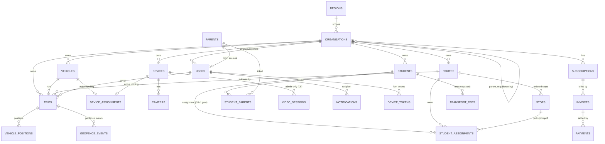

# RAAD Platform — Phase 3.2: Database Design (LLD)

**Prepared by:** Senior Enterprise Software Architect
**Phase:** 3.2 — Database Design (design documentation only; **no DDL / no implementation code**)
**Engine:** MySQL 8.x (Phase-2 §10) with Redis for hot state (latest position, sessions, caches).
**Traceability:** Phase-2 Architecture (§2, §10, §12, §17), Backend LLD (§10.4, §7, §10), locked decisions **D1–D6**, and **CR-1** (`SubscriptionAccessPolicy`; the `student_assignments` state is the access gate). No new business requirements introduced.

> **Notation.** Tables are specified as **column tables** (name · type · null · key/constraint · notes). Types are logical (final DDL authored at build time). This is a design artifact, not schema code.

---

## 1. Naming Conventions

| Element | Convention | Example |
|---------|-----------|---------|
| Table names | `snake_case`, **plural** | `student_assignments` |
| Column names | `snake_case`, **singular** | `assigned_at` |
| Primary key | `id` | `id` |
| Foreign key | `<referenced_singular>_id` | `vehicle_id`, `route_id` |
| Tenant key | `organization_id` on every tenant-owned table | `organization_id` |
| Booleans | `is_` / `has_` prefix | `is_active` |
| Timestamps | `_at` suffix, **UTC**, `DATETIME(3)`/`TIMESTAMP` | `created_at`, `deleted_at` |
| Enums | stored as short `VARCHAR`/`ENUM` + documented value set (via `CHECK`) | `status` |
| Indexes | `ix_<table>__<cols>` (secondary), `ux_<table>__<cols>` (unique), `fk_<table>__<ref>` | `ix_trips__org_status` |
| Partitioned tables | suffix noted in comments; partition key documented | `vehicle_positions` |
| JSON columns | `_json` suffix or documented | `metadata_json` |

**Identifier type:** primary keys are **ULID/UUIDv7** stored as `CHAR(26)`/`BINARY(16)` — time-sortable (index-friendly) per Backend LLD §20. All keys are opaque strings in the API.

**Standard audit columns** (present on all business tables unless noted):

| Column | Type | Null | Notes |
|--------|------|------|-------|
| `id` | CHAR(26) | no | PK (ULID) |
| `created_at` | DATETIME(3) | no | UTC |
| `updated_at` | DATETIME(3) | no | UTC; app-maintained |
| `created_by` | CHAR(26) | yes | actor user id (null for system) |
| `updated_by` | CHAR(26) | yes | actor user id |
| `deleted_at` | DATETIME(3) | yes | **soft delete** (see §9); null = live |
| `row_version` | INT | no | optimistic-lock counter |

---

## 2. Multi-Tenant Strategy

- **Model (MVP):** **shared schema, `organization_id` discriminator** on every tenant-owned table (Phase-2 §10.2, Backend LLD §7). Isolation is enforced at the repository layer (auto-injected `organization_id` filter) **and** re-checked in the authorization layer — defense in depth.
- **Tenant root:** `organizations`. All tenant data references it (directly or transitively).
- **RAAD-staff scope:** platform users (Founder / Regional Manager / Support / Finance) are **not** tenant-bound; their visibility is computed via `regions` + `region_assignments` / `support_assignments` (Phase-2 §17), applied as an *additional* scope filter.
- **Organization hierarchy:** `organizations.parent_org_id` (self-ref, nullable) supports operator → sub-org/campus (Phase-2 §18); the **isolation boundary is the top of the hierarchy**.
- **Hardening path (documented seam):** sensitive tenants can migrate to schema-per-tenant or a dedicated DB without model change, because tenancy is centralized (Phase-2 §10.2 / R5).

**Cross-module FK rule (module seams):** foreign keys are declared **within a bounded context**; **across contexts, references are by id without a hard FK** (Phase-2 §10.4, LLD §2.2) so a module can later be extracted. Referential integrity across contexts is maintained by the application + events. Cross-context reference columns are indexed but not FK-constrained; this is noted per table.

---

## 3. Entity-Relationship Diagram (core)

> The ERD shows core relationships; the video/notification/billing/audit satellites are detailed in their table specs below. Lines across bounded contexts are **logical references** (no hard FK) per §2.

---

## 4. Tables — Identity & Access + Organization (C1, C2)

### 4.1 `regions`
| Column | Type | Null | Key | Notes |
|--------|------|------|-----|-------|
| id | CHAR(26) | no | PK | |
| name | VARCHAR(120) | no | UX | unique region name |
| geographic_scope | VARCHAR(255) | yes | | descriptive/geo metadata |
| status | ENUM(active,inactive) | no | | |
| + standard audit cols | | | | |

### 4.2 `organizations`
| Column | Type | Null | Key | Notes |
|--------|------|------|-----|-------|
| id | CHAR(26) | no | PK | tenant root |
| name | VARCHAR(200) | no | | |
| org_type | ENUM(school,…) | no | | **D3**: only `school` active; enum seam for future variants |
| parent_org_id | CHAR(26) | yes | FK→organizations.id | hierarchy (§2, Phase-2 §18) |
| region_id | CHAR(26) | no | FK→regions.id | scoping (Phase-2 §17) |
| billing_model | ENUM(organization_pays,parent_pays) | no | | **CR-1** input |
| status | ENUM(active,suspended,inactive) | no | ix | |
| + standard audit cols | | | | soft delete supported |

Indexes: `ix_organizations__region`, `ix_organizations__parent`, `ix_organizations__status`.

### 4.3 `users`
Single identity table for **all** principals (RAAD staff, org admins, drivers, parents), discriminated by `role`.
| Column | Type | Null | Key | Notes |
|--------|------|------|-----|-------|
| id | CHAR(26) | no | PK | |
| organization_id | CHAR(26) | yes | ix | null for RAAD staff (platform-level) |
| role | ENUM(founder,regional_manager,support_staff,finance_staff,org_admin,driver,parent) | no | ix | Ch. 4 |
| email | VARCHAR(255) | yes | UX | unique global (nullable) |
| phone | VARCHAR(32) | yes | UX | unique global (nullable); E.164 |
| password_hash | VARCHAR(255) | yes | | Argon2/bcrypt (LLD §17) |
| full_name | VARCHAR(200) | no | | |
| status | ENUM(active,disabled,invited) | no | ix | |
| mfa_enabled | BOOL | no | | recommended for privileged roles |
| last_login_at | DATETIME(3) | yes | | |
| + standard audit cols | | | | |

Constraints: at least one of `email`/`phone` present (CHECK). `organization_id` required when `role ∈ {org_admin, driver, parent}`.

### 4.4 `roles`, `permissions`, `role_permissions` (reference/RBAC)
Seedable reference data backing the permission matrix (LLD §17). `roles(id,key,label)`, `permissions(id,key,label)`, `role_permissions(role_key,permission_key)` (composite PK). Editable by Founder to support future roles (Ch. 4.9) without code change.

### 4.5 `refresh_tokens`
| Column | Type | Null | Key | Notes |
|--------|------|------|-----|-------|
| id | CHAR(26) | no | PK | |
| user_id | CHAR(26) | no | FK→users.id, ix | |
| token_hash | CHAR(64) | no | UX | hashed refresh token |
| issued_at | DATETIME(3) | no | | |
| expires_at | DATETIME(3) | no | ix | |
| revoked_at | DATETIME(3) | yes | | rotation/logout |
| user_agent / ip | VARCHAR | yes | | audit context |

### 4.6 `region_assignments` / `support_assignments`
RAAD-staff scoping (Phase-2 §17). `region_assignments(user_id, region_id, granted_by, granted_at)` composite; `support_assignments(user_id, organization_id, granted_by, granted_at)` composite. Indexed both directions.

### 4.7 `org_settings`
Per-org configuration (`organization_id` PK/unique), JSON `settings_json` (feature toggles like parent-video-enabled=false by default — D5), notification defaults, geofence default radius/approach threshold (Phase-2 §22.1).

---

## 5. Tables — Fleet & Device (C3)

### 5.1 `vehicles`
| Column | Type | Null | Key | Notes |
|--------|------|------|-----|-------|
| id | CHAR(26) | no | PK | |
| organization_id | CHAR(26) | no | FK, ix | tenant |
| plate_no | VARCHAR(32) | no | | |
| label | VARCHAR(120) | yes | | display name |
| capacity | INT | yes | | seats |
| status | ENUM(active,inactive,maintenance) | no | ix | |
| + standard audit cols | | | | soft delete |

Unique: `ux_vehicles__org_plate (organization_id, plate_no)` (per-tenant uniqueness).

### 5.2 `devices`
| Column | Type | Null | Key | Notes |
|--------|------|------|-----|-------|
| id | CHAR(26) | no | PK | |
| organization_id | CHAR(26) | no | FK, ix | |
| terminal_id | VARCHAR(64) | no | UX | JT808 terminal/SIM identifier (global unique) |
| model | VARCHAR(120) | yes | | |
| vendor | VARCHAR(120) | yes | | adapter selection (Phase-2 §5.1 ACL) |
| sim_msisdn | VARCHAR(32) | yes | | masked in logs |
| lifecycle_state | ENUM(registered,activated,assigned,suspended,retired) | no | ix | Phase-2 §19.2 |
| auth_key_hash | VARCHAR(255) | yes | | device auth (Phase-2 §12.7) |
| last_seen_at | DATETIME(3) | yes | | connectivity (runtime state lives in Redis; this is a durable mirror) |
| + standard audit cols | | | | |

### 5.3 `cameras`
| Column | Type | Null | Key | Notes |
|--------|------|------|-----|-------|
| id | CHAR(26) | no | PK | |
| organization_id | CHAR(26) | no | ix | (denormalized tenant for scoping) |
| device_id | CHAR(26) | no | FK→devices.id, ix | |
| channel_no | INT | no | | JT1078 channel |
| label | VARCHAR(120) | yes | | |
| position | ENUM(in_cabin,road_facing,other) | no | | **D5**: `in_cabin` never exposed to parents |
| + standard audit cols | | | | |

Unique: `ux_cameras__device_channel (device_id, channel_no)`.

### 5.4 `device_assignments` (device↔vehicle history — Phase-2 §19)
| Column | Type | Null | Key | Notes |
|--------|------|------|-----|-------|
| id | CHAR(26) | no | PK | |
| organization_id | CHAR(26) | no | ix | |
| device_id | CHAR(26) | no | FK→devices.id, ix | |
| vehicle_id | CHAR(26) | no | FK→vehicles.id, ix | |
| assigned_by | CHAR(26) | yes | | actor |
| assigned_at | DATETIME(3) | no | | |
| unassigned_at | DATETIME(3) | yes | | null = **active** binding |
| active_device_key | CHAR(26) generated | yes | UX | = device_id when active else NULL |
| active_vehicle_key | CHAR(26) generated | yes | UX | = vehicle_id when active else NULL |

**One active binding per device & per vehicle** (Ch. 7.4/7.5) is enforced by two **generated-column unique indexes** (`ux_device_assignments__active_device`, `ux_device_assignments__active_vehicle`) — MySQL's idiom for a partial-unique constraint. **Driver is deliberately absent** from this table (Phase-2 §19.1: device≠driver; changing a driver never touches this row).

---

## 6. Tables — Transport Operations (C4)

### 6.1 `drivers`
Profile for users with `role=driver`. `drivers(id, organization_id, user_id FK→users, license_no, status, +audit)`. Vehicle↔driver is per-trip (see `trips.driver_id`), not stored here.

### 6.2 `students`
| Column | Type | Null | Key | Notes |
|--------|------|------|-----|-------|
| id | CHAR(26) | no | PK | |
| organization_id | CHAR(26) | no | FK, ix | |
| full_name | VARCHAR(200) | no | | |
| external_ref | VARCHAR(64) | yes | | school-side id |
| status | ENUM(active,disabled,graduated,transferred) | no | ix | **CR-1**: non-active statuses revoke parent access via assignment |
| + standard audit cols | | | | soft delete distinct from status |

### 6.3 `parents`
`parents(id, organization_id, user_id FK→users, full_name, phone, status, +audit)`. Login is via the linked `users` row (`role=parent`).

### 6.4 `student_parents` (M:N)
| Column | Type | Null | Key | Notes |
|--------|------|------|-----|-------|
| student_id | CHAR(26) | no | PK, FK→students.id | |
| parent_id | CHAR(26) | no | PK, FK→parents.id | |
| relationship | VARCHAR(40) | yes | | guardian/mother/etc. |
| is_primary | BOOL | no | | |

Composite PK `(student_id, parent_id)`. A student has ≥1 parent (Ch. 7.7) — enforced by application on create.

### 6.5 `routes`
`routes(id, organization_id, name, status(active,inactive), +audit)`. Unique `(organization_id, name)`.

### 6.6 `stops`
| Column | Type | Null | Key | Notes |
|--------|------|------|-----|-------|
| id | CHAR(26) | no | PK | |
| organization_id | CHAR(26) | no | ix | |
| route_id | CHAR(26) | no | FK→routes.id, ix | |
| name | VARCHAR(160) | no | | |
| latitude | DECIMAL(9,6) | no | | |
| longitude | DECIMAL(9,6) | no | | |
| sequence_no | INT | no | | order in route |
| geofence_radius_m | INT | yes | | overrides org default (Phase-2 §22.1) |
| + standard audit cols | | | | |

Unique: `ux_stops__route_sequence (route_id, sequence_no)`.

### 6.7 `student_assignments` — **the CR-1 access gate**
| Column | Type | Null | Key | Notes |
|--------|------|------|-----|-------|
| id | CHAR(26) | no | PK | |
| organization_id | CHAR(26) | no | FK, ix | |
| student_id | CHAR(26) | no | FK→students.id, ix | |
| route_id | CHAR(26) | no | FK→routes.id, ix | |
| pickup_stop_id | CHAR(26) | no | FK→stops.id | Ch. 7.7 |
| dropoff_stop_id | CHAR(26) | no | FK→stops.id | Ch. 7.7 |
| vehicle_id | CHAR(26) | yes | ix | assigned vehicle (Ch. 6.6) |
| status | ENUM(active,removed,transferred,graduated,disabled) | no | ix | **drives `SubscriptionAccessPolicy` (CR-1)** |
| assigned_at | DATETIME(3) | no | | |
| ended_at | DATETIME(3) | yes | | set when status leaves `active` |
| active_student_key | CHAR(26) generated | yes | UX | = student_id when status=active else NULL |
| + standard audit cols | | | | |

**One active assignment per student** enforced by generated-column unique index `ux_student_assignments__active_student`. Status changes here are the source of the CR-1 re-evaluation events (`StudentAssignmentRemoved/Transferred/Graduated/Disabled`, LLD §5.4). Indexed `ix_student_assignments__org_status`, `ix_student_assignments__student_status`.

### 6.8 `trips`
| Column | Type | Null | Key | Notes |
|--------|------|------|-----|-------|
| id | CHAR(26) | no | PK | |
| organization_id | CHAR(26) | no | FK, ix | |
| vehicle_id | CHAR(26) | no | ix | logical ref |
| driver_id | CHAR(26) | no | ix | user id (role=driver) |
| route_id | CHAR(26) | no | ix | logical ref |
| trip_type | ENUM(morning,afternoon) | no | | Ch. 7.9 independent |
| status | ENUM(scheduled,in_progress,interrupted,completed) | no | ix | Phase-2 §6.2 |
| scheduled_date | DATE | no | ix | |
| started_at | DATETIME(3) | yes | | |
| ended_at | DATETIME(3) | yes | | |
| + standard audit cols | | | | |

**One active trip per vehicle** (Ch. 7.4) enforced via generated-column unique `ux_trips__active_vehicle` (= vehicle_id when status=in_progress else NULL). Index `ix_trips__org_date_status`.

### 6.9 `trip_students` (roster snapshot)
`(trip_id, student_id)` composite — snapshot of the roster for history/reporting (Phase-2 §6.2). No boarding fields (D1).

---

## 7. Tables — Tracking (C5), Video (C6), Notifications (C7)

### 7.1 `vehicle_positions` — **high-write, partitioned**
| Column | Type | Null | Key | Notes |
|--------|------|------|-----|-------|
| id | CHAR(26) | no | PK(part of) | |
| organization_id | CHAR(26) | no | ix | |
| vehicle_id | CHAR(26) | no | ix | |
| device_id | CHAR(26) | no | | |
| trip_id | CHAR(26) | yes | ix | null when no active trip |
| latitude | DECIMAL(9,6) | no | | |
| longitude | DECIMAL(9,6) | no | | |
| speed_kph | SMALLINT | yes | | |
| heading_deg | SMALLINT | yes | | |
| alarm_flags | INT | yes | | JT808 alarm bitfield (normalized) |
| is_backfill | BOOL | no | | Phase-2 §5.1 backfill handling |
| event_time | DATETIME(3) | no | **partition key** | device-reported time |
| received_at | DATETIME(3) | no | | server ingest time |

- **Latest position is NOT read from here** — it lives in Redis (Phase-2 §10.3). This table is the durable history.
- **Partitioning:** RANGE partition by `event_time` (monthly). See §11.
- Indexes: `ix_vehicle_positions__veh_time (vehicle_id, event_time)`, `ix_vehicle_positions__trip_time (trip_id, event_time)`. PK includes the partition key per MySQL partitioning rules.

### 7.2 `geofence_events`
`(id, organization_id, trip_id, stop_id?, event_type ENUM(approaching_stop,entered_stop,arrived_org,exited), occurred_at, +created_at)`. Indexed `(trip_id, occurred_at)`. Long-term retained (Phase-2 §10.3). Feeds notifications (D1).

### 7.3 `device_status_log`
`(id, organization_id, device_id, status ENUM(online,offline), changed_at)` — durable connectivity transitions (Phase-2 §21). Indexed `(device_id, changed_at)`.

### 7.4 `video_sessions` — **admin-only (D5)**
| Column | Type | Null | Key | Notes |
|--------|------|------|-----|-------|
| id | CHAR(26) | no | PK | |
| organization_id | CHAR(26) | no | ix | |
| device_id | CHAR(26) | no | ix | |
| camera_id | CHAR(26) | no | | |
| purpose | ENUM(live,playback) | no | | |
| requested_by | CHAR(26) | no | | **must be org_admin / permitted RAAD staff** — never parent (D5) |
| window_start / window_end | DATETIME(3) | yes | | playback range |
| status | ENUM(requested,active,ended,failed) | no | | |
| started_at / ended_at | DATETIME(3) | yes | | |
| + created_at | | | | every session audited (§10, §12.5) |

Stores **control metadata only** — no video is persisted (Phase-2 §11.9). `playback_requests` follows the same shape for playback-specific tracking.

### 7.5 `notifications` (in-app store — D2)
| Column | Type | Null | Key | Notes |
|--------|------|------|-----|-------|
| id | CHAR(26) | no | PK | |
| organization_id | CHAR(26) | no | ix | |
| recipient_user_id | CHAR(26) | no | ix | |
| type | ENUM(trip_started,approaching_stop,arrived_org,trip_completed,subscription,system) | no | | D1 catalog + billing/system class |
| title | VARCHAR(160) | no | | |
| body | VARCHAR(500) | no | | |
| data_json | JSON | yes | | deep-link payload |
| trip_id | CHAR(26) | yes | | context |
| created_at | DATETIME(3) | no | ix | |
| read_at | DATETIME(3) | yes | | |

Index `ix_notifications__recipient_created (recipient_user_id, created_at)`. Candidate for time-partitioning at scale (§11).

### 7.6 `device_tokens` (FCM)
`(id, user_id FK, fcm_token, platform ENUM(android,ios), created_at, revoked_at)`. Unique `ux_device_tokens__token (fcm_token)`.

### 7.7 `notification_preferences`
`(user_id PK, prefs_json)` — minimal; channels limited to FCM+in-app (D2).

---

## 8. Tables — Billing (C8), Reporting (C9), Platform & Audit (C10)

### 8.1 `plans`
`(id, name, billing_scope ENUM(organization,parent), price_amount DECIMAL(12,2), currency CHAR(3), billing_cycle ENUM(monthly,quarterly,annual), vehicle_limit INT?, features_json, status, +audit)`.

### 8.2 `subscriptions`
| Column | Type | Null | Key | Notes |
|--------|------|------|-----|-------|
| id | CHAR(26) | no | PK | |
| organization_id | CHAR(26) | no | ix | |
| subscriber_type | ENUM(organization,parent) | no | ix | maps to billing_model (CR-1) |
| subscriber_id | CHAR(26) | no | ix | org id or parent id |
| plan_id | CHAR(26) | no | | |
| status | ENUM(trial,active,suspended,expired,cancelled) | no | ix | Phase-2 §9.4 |
| current_period_start / end | DATETIME(3) | yes | ix(end) | `end` drives expiry sweep + CR-1 |
| auto_renew | BOOL | no | | |
| + standard audit cols | | | | |

Index `ix_subscriptions__subscriber (subscriber_type, subscriber_id, status)` and `ix_subscriptions__period_end` (for the expiry scheduler, LLD §11).

### 8.3 `invoices`
`(id, organization_id, subscription_id FK, number UX, amount, currency, period_start, period_end, status ENUM(draft,issued,paid,void), issued_at, due_at, paid_at, +audit)`.

### 8.4 `payments`
| Column | Type | Null | Key | Notes |
|--------|------|------|-----|-------|
| id | CHAR(26) | no | PK | |
| organization_id | CHAR(26) | no | ix | |
| invoice_id | CHAR(26) | no | FK→invoices.id, ix | |
| provider | VARCHAR(40) | no | | `evcplus` (provider-agnostic, Phase-2 §20) |
| provider_ref | VARCHAR(120) | yes | | gateway transaction id |
| msisdn_masked | VARCHAR(32) | yes | | masked payer number |
| amount | DECIMAL(12,2) | no | | |
| currency | CHAR(3) | no | | |
| status | ENUM(pending,processing,paid,failed,expired,refunded) | no | ix | Phase-2 §20.3 |
| idempotency_key | CHAR(64) | no | UX | **prevents double charge** (Phase-2 §20.4) |
| created_at / confirmed_at | DATETIME(3) | | | |

Unique: `ux_payments__idem (idempotency_key)`, `ux_payments__provider_ref (provider, provider_ref)`.

### 8.5 `transport_fees` (separate from subscription — Ch. 7.12)
`(id, organization_id, student_id FK, period, amount, currency, status ENUM(due,paid,overdue,waived), +audit)`. Informational to parents; never gates safety by itself and is distinct from `subscriptions`.

### 8.6 `report_runs`
`(id, organization_id, definition_key, params_json, status ENUM(queued,running,succeeded,failed), artifact_url, requested_by, created_at, completed_at)`. Artifacts (PDF/Excel) stored in object store (Phase-2 §10.1), not in the DB.

### 8.7 `audit_entries` — **append-only (§10)**
| Column | Type | Null | Key | Notes |
|--------|------|------|-----|-------|
| id | CHAR(26) | no | PK | |
| organization_id | CHAR(26) | yes | ix | null for platform-level actions |
| actor_user_id | CHAR(26) | yes | ix | |
| action | VARCHAR(80) | no | ix | e.g., `video.session.start` |
| entity_type | VARCHAR(60) | yes | | |
| entity_id | CHAR(26) | yes | | |
| metadata_json | JSON | yes | | masked; no secrets/PII (LLD §13) |
| ip | VARCHAR(45) | yes | | |
| correlation_id | CHAR(26) | yes | ix | trace linkage |
| created_at | DATETIME(3) | no | ix | |

**No `updated_at`/`deleted_at`** — audit rows are immutable and never soft/hard deleted (Ch. 7.13). Candidate for monthly partitioning (§11).

### 8.8 `outbox` (transactional outbox — LLD §10)
`(id, event_id UX, event_type, event_version, aggregate_type, aggregate_id, organization_id, payload_json, correlation_id, created_at, published_at?)`. Index `ix_outbox__unpublished (published_at)` for the relay. Written in the same transaction as the business change.

### 8.9 `system_settings`, `integrations`
`system_settings(key PK, value_json, scope)`; `integrations(id, organization_id?, type, config_json, status, +audit)`.

---

## 9. Soft-Delete Strategy

- **Soft delete = `deleted_at` timestamp** on business tables; the repository layer adds `deleted_at IS NULL` to every read by default (LLD §7). A dedicated path allows admins to read/restore.
- **Soft delete ≠ business status.** `students.status` (`disabled/graduated/transferred`) and `student_assignments.status` are **domain states** that drive behavior (CR-1); they are *not* deletion. Deleting a student is a separate, rarely-used soft delete; the CR-1 access revocation flows through `status`/assignment changes, not `deleted_at`.
- **Never hard-delete** audit, outbox (until published + archived), or financial rows (invoices/payments) — regulatory/traceability.
- **Exception — telemetry:** `vehicle_positions` are **hard-pruned by dropping old partitions** (retention window, §11); this is bulk lifecycle management, not per-row soft delete.
- **Uniqueness + soft delete:** unique constraints that must ignore soft-deleted rows use the generated-column idiom (as with active-assignment keys) so a deleted row doesn't block re-creation.

---

## 10. Audit Tables & Strategy

- **`audit_entries`** is the immutable, append-only record of every important action (Ch. 7.13, Phase-2 §12.8): auth events, RBAC/scope changes, device assignment/reassignment, trip start/end, **every video session open/close (D5)**, subscription/payment transitions, and access-revoking events (CR-1). Written **transactionally** by the domain (LLD §13 — audit is a domain concern, not a logging side-effect).
- **`outbox`** doubles as a reliable event ledger; combined with `audit_entries` it gives both "what changed" (audit) and "what was published" (outbox).
- **Retention:** audit retained long-term (per policy); access permission-gated; never exposed cross-tenant (`organization_id` scoped, platform actions null-org visible to Founder only).

---

## 11. Partition & Index Strategy

### 11.1 Partitioning
| Table | Scheme | Key | Rationale |
|-------|--------|-----|-----------|
| `vehicle_positions` | RANGE, **monthly** | `event_time` | High write volume; prune by dropping old partitions (retention ~90 days raw, Phase-2 §10.3); fast time-range history reads |
| `audit_entries` | RANGE, monthly (optional) | `created_at` | Bounded growth; efficient archival |
| `notifications` | RANGE, monthly (at scale) | `created_at` | Large, time-addressed; older partitions archivable |

**Scale path:** when partitioned MySQL for positions is outgrown, migrate `vehicle_positions` to a TSDB (TimescaleDB) behind the same repository interface (Phase-2 §10.3 / R4) — no domain change.

### 11.2 Index strategy (principles)
- **Tenant-first composite indexes:** almost every operational query filters by `organization_id` — lead composite indexes with it (e.g., `ix_trips__org_date_status (organization_id, scheduled_date, status)`).
- **Time-series indexes** on `(entity_id, time)` for positions/geofence/notifications.
- **Uniqueness** via natural keys where per-tenant (`(organization_id, plate_no)`), global where identity (`terminal_id`, `email`, `fcm_token`, `idempotency_key`).
- **Partial-unique via generated columns** for "one active X" invariants (device↔vehicle, active student assignment, active trip per vehicle).
- **Foreign-key indexes** on all in-context FK columns; **cross-context reference columns indexed but not FK-constrained** (§2 module-seam rule).
- **Covering indexes** for hot read paths (e.g., notification list) considered at tuning time.
- **Avoid over-indexing** write-heavy `vehicle_positions` — only the two access paths above.

### 11.3 Referential integrity summary
- **In-context FKs:** enforced by the DB (e.g., `stops.route_id → routes.id`, `payments.invoice_id → invoices.id`).
- **Cross-context references:** by id, integrity maintained by application + events (e.g., `trips.vehicle_id`, `vehicle_positions.trip_id`, `parents.user_id`). This preserves the module seams that make service extraction possible (Phase-2 §13) while keeping strong integrity where it matters most.

---

## 12. Design Rationale Summary

| ID | Decision | Rationale | Trace |
|----|----------|-----------|-------|
| DB-1 | Shared-schema multi-tenancy + `organization_id` everywhere | Cost/simplicity at MVP; strict isolation enforced centrally; hardening seam retained | Phase-2 §10.2, LLD §7 |
| DB-2 | In-context FKs; cross-context references by id | Preserves module seams for extraction while keeping local integrity | Phase-2 §10.4, §13 |
| DB-3 | `student_assignments.status` as the CR-1 access gate | Single source of truth for "immediately loses access"; emits revocation events | **CR-1** |
| DB-4 | Generated-column partial-unique for "one active X" | Enforces device↔vehicle, active assignment, active trip invariants in-DB | Ch. 7.4/7.5, Phase-2 §19 |
| DB-5 | Driver absent from `device_assignments` | Encodes device≠driver; driver change never touches device binding | Phase-2 §19.1 |
| DB-6 | Latest position in Redis; history in partitioned `vehicle_positions` | Real-time reads + bounded write growth; TSDB path | Phase-2 §10.3 |
| DB-7 | ULID/UUIDv7 keys | Time-sortable, index-friendly, opaque in API | LLD §20 |
| DB-8 | Immutable `audit_entries` + `outbox` ledger | Traceability + reliable events | Ch. 7.13, LLD §10 |
| DB-9 | Soft delete via `deleted_at`, distinct from business status | Avoids conflating deletion with domain state (esp. CR-1) | LLD §7 |
| DB-10 | Partition positions/audit/notifications by time | Prune/archive at scale; fast time-range reads | Phase-2 §10.3 |
| DB-11 | Video tables store control metadata only | No cloud video storage; every session audited | Phase-2 §11.9, D5 |

---

*End of Phase 3.2 — Database Design. Documentation only; no DDL or implementation code. Column types are logical and finalized at build time.*

