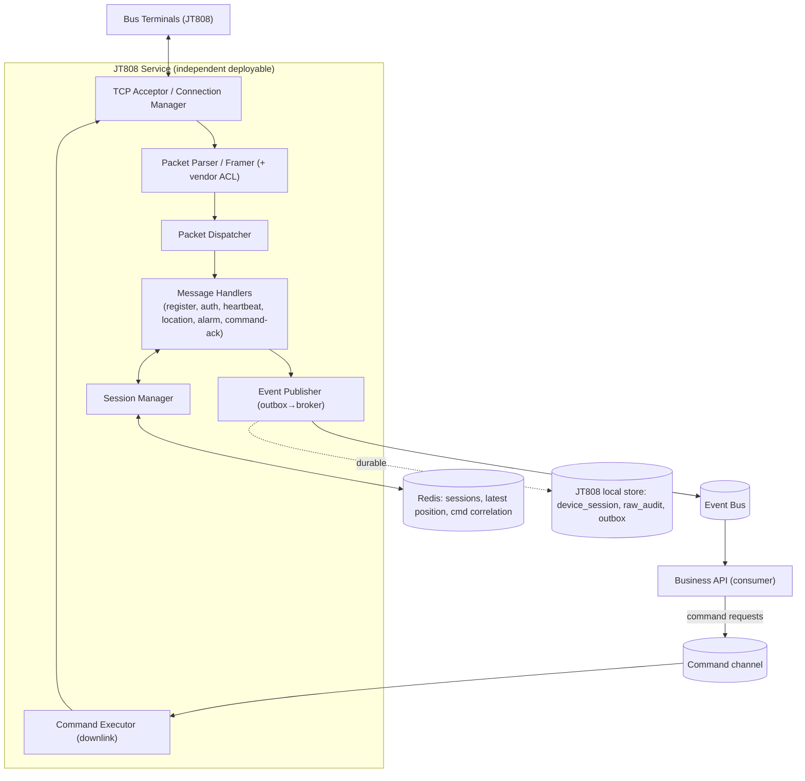
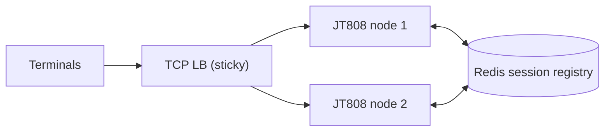
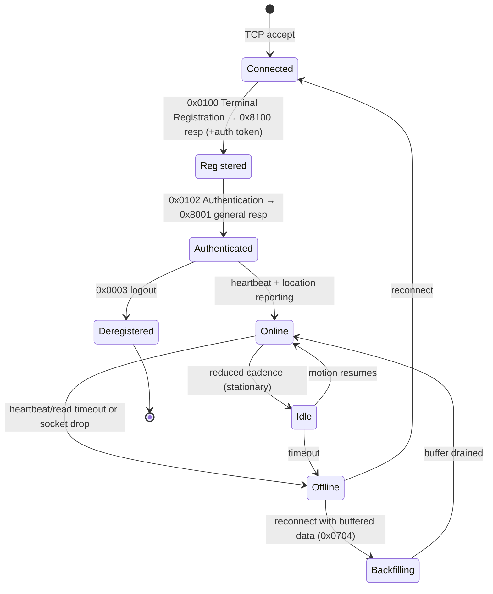
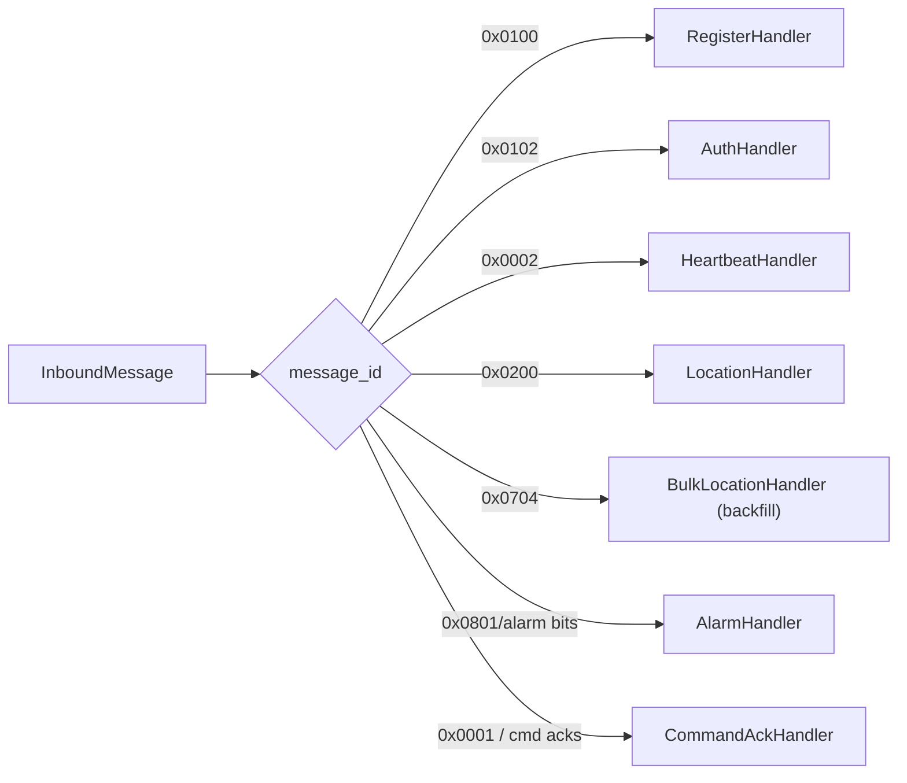
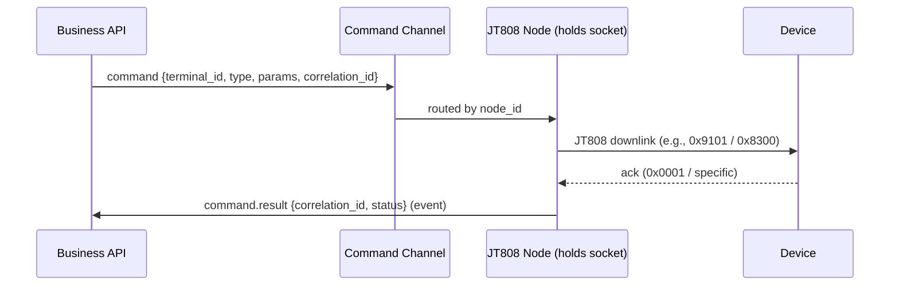
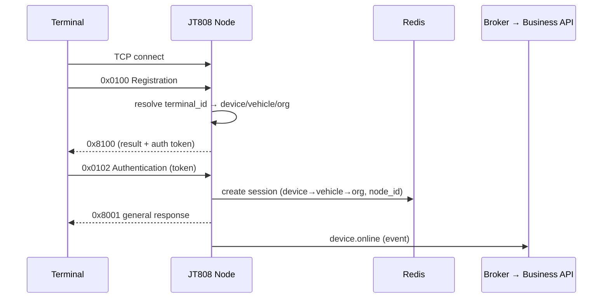

# RAAD Platform — Phase 3.4: JT808 Service Technical Design (LLD)

**Prepared by:** Senior Enterprise Software Architect
**Phase:** 3.4 — JT808 (GPS / telematics) service (design documentation only; **no implementation code**)
**Traceability:** Project Brief (Ch. 5.7, 8.7, 11.7), Enterprise Architecture (§4, §5.1, §6, §21), Backend LLD (§10 events, §6.2 device ports), Database Design (§5, §7.1, §8.8), API Contracts (§13 events). Locked decisions **D1–D6**, **CR-1**.

**Device-plane business rules honored:** JT808 and JT1078 are **independent services**; **FastAPI never talks to devices**; **JT808 publishes events to the Business API** (never calls its DB directly); JT808 handles GPS/telematics/commands only.

> **Notation.** Contracts are language-neutral skeletons (signatures/fields only, no bodies). JT/T 808 message IDs (e.g., `0x0200`) are cited per the standard; exact byte layouts are an implementation-time concern and are not reproduced here.

---

## 1. Overall JT808 Service Architecture

The JT808 service is a **standalone, horizontally shardable TCP service** whose sole job is to terminate device connections, normalize JT808 traffic into **canonical domain events**, and relay **platform commands** down to devices. It shares **no process** with the Business API and holds **no business logic** beyond protocol handling and device↔vehicle↔org resolution.



**Boundary rules:**
- JT808 **publishes events** (`device.position_reported`, `device.online/offline`, `device.alarm_raised`, command-acks) to the broker; the Business API consumes them and owns all persistence of business tables (Database Design §5/§7). JT808 does **not** write `vehicle_positions` directly — it emits events; the Business API's tracking consumer persists (keeps DB ownership with the owning context and preserves module seams).
- JT808 owns a **small local store** for operational needs it must not lose across restarts: its **own** `outbox`, a durable mirror of device sessions, and optional raw-frame audit. (Design choice justified in ADR-808-2.)
- The Business API sends **command requests** (e.g., "request real-time A/V", "text to driver", "set reporting interval") to JT808 over a command channel (broker topic / internal RPC) — **never** by opening a device socket (D6).

---

## 2. TCP Server Architecture

- **Async, event-loop-based acceptor** handling many thousands of concurrent persistent TCP connections per node (Phase-2 §5.1). One logical connection = one device session.
- **Framing:** JT808 uses `0x7e` delimiters with escaping and an XOR checksum; the framer reassembles whole messages from the byte stream before parsing (handles partial reads / coalesced packets).
- **Backpressure:** per-connection read/write buffers with limits; slow-consumer connections are throttled, not allowed to exhaust memory.
- **Sharding:** devices are distributed across nodes by a **sticky TCP load balancer** (hash on source / device); the **Session Manager in Redis** is the shared source of truth so any node can resolve any device's mapping (Phase-2 §5.1, §11.3).
- **Isolation:** runs in the device DMZ subnet (Phase-2 §11.3), never internet-general-exposed beyond the device ports.



---

## 3. Device Connection Lifecycle

Maps to the connectivity state machine in Enterprise Architecture §21.1.



- **Connected → Registered:** device sends `0x0100`; service resolves it (see §4), replies `0x8100` with a result + auth token.
- **Registered → Authenticated:** device sends `0x0102` with the token; service validates and replies `0x8001`.
- **Authenticated → Online:** heartbeats (`0x0002`) and location reports (`0x0200`) flow.
- **Offline:** heartbeat/read-timeout or socket close ⇒ emit `device.offline`; on reconnect emit `device.online`.
- **Backfilling:** reconnect may carry buffered positions via bulk upload (`0x0704`) — handled specially (§10).

---

## 4. Device Authentication

- **Provisioning:** during Device Management onboarding (API Contracts §4.2, DB `devices.terminal_id`, `devices.auth_key_hash`), a device is registered with a `terminal_id` and an auth secret.
- **Registration (`0x0100`):** the service looks up the `terminal_id` → resolves `device → vehicle → organization`. Unknown/duplicate/unassigned terminal ⇒ registration rejected with the appropriate `0x8100` result code and an audit entry; the socket is closed.
- **Authentication (`0x0102`):** the presented auth code is verified against `auth_key_hash`. Failure ⇒ reject + audit + close.
- **Session token:** on success, a short-lived session auth token is issued (held in Redis) and required for the authenticated session; token rotation on reconnect.
- **Compensating controls (weak native security, Phase-2 §12.7):** IP/APN allow-listing where the operator supports it; anomaly detection on registration floods; DMZ isolation; TLS on the device link where the terminal supports it.
- **Multi-tenancy:** the resolved `organization_id` is bound into the session so **every** emitted event is tenant-stamped (Backend LLD §10.3, DB §2).

---

## 5. Session Manager

Owns the runtime identity of every connected device.

```
SessionManager (contract):
  create(terminal_id, connection_ref) -> Session            # after auth
  resolve(terminal_id) -> {device_id, vehicle_id, organization_id, node_id, auth_state, last_seen}
  touch(terminal_id, at)                                    # heartbeat/location updates last_seen
  bind_command_route(terminal_id) -> node_id                # for downlink routing across shards
  close(terminal_id, reason)                                # emits device.offline
```

- **Backing store: Redis** (authoritative, shared across shards) — `session:{terminal_id} → {…, node_id}` with TTL refreshed by heartbeats; plus a **durable mirror** in the JT808 local store (`device_session`) so operational state survives a full Redis flush (ADR-808-2).
- **device→vehicle→org mapping** is cached in the session; it is **re-resolved** on `device.reassigned` events (Phase-2 §19.2) so positions attribute to the correct vehicle after a reassignment without a device reconnect.
- **Cross-shard command routing:** `node_id` in the registry lets the Business API's command reach the exact node holding the device's socket.

---

## 6. Packet Parser

- **Responsibilities:** de-frame (`0x7e` unescaping), verify checksum, read the JT808 header (message id, body attributes, terminal phone/id, serial no, fragmentation fields), and produce a **typed, validated `InboundMessage`** value object. Malformed/checksum-fail frames are dropped + counted + logged (never crash the connection).
- **Fragmentation:** JT808 messages may be split; the parser reassembles multi-packet messages by (terminal, message-id, total/index) before dispatch.
- **Vendor ACL (Anti-Corruption Layer, Phase-2 §5.1):** a **vendor-adapter** step normalizes dialect differences (extra/optional fields, alarm-bit conventions, location extension items) into RAAD's canonical types. Vendor is known from `devices.vendor`. New vendor = new adapter; core parser unchanged (ADR-808-3).

```
InboundMessage {
  message_id, terminal_id, serial_no, body_fields (typed), raw_ref (optional), received_at
}
```

---

## 7. Packet Dispatcher

- Routes a parsed `InboundMessage` to the correct **handler** by `message_id`, on a per-connection ordered execution context (preserves per-device ordering; different devices run concurrently).
- **Automatic general response:** for message types requiring `0x8001`/platform-general-response, the dispatcher ensures the ack is sent (correctly or with the error result) even if the handler defers heavier work to the event pipeline.
- **Unknown message ids** are logged + counted and answered per protocol (general response with "not supported" where applicable) rather than dropped silently.



---

## 8. Message Handlers

| Handler | Trigger (msg) | Action | Emits |
|---------|---------------|--------|-------|
| Register | `0x0100` | resolve device, issue token, reply `0x8100` | (audit) |
| Auth | `0x0102` | verify token, activate session, reply `0x8001` | `device.online` |
| Heartbeat | `0x0002` | touch session, reply `0x8001` | (session touch) |
| Location | `0x0200` | normalize position + alarm bits | `device.position_reported` (+ `device.alarm_raised` if flagged) |
| Bulk Location | `0x0704` | ingest buffered positions (backfill) | N × `device.position_reported` (`is_backfill=true`) |
| Alarm | alarm bits / `0x0801` (media) | classify alarm | `device.alarm_raised` |
| Command Ack | `0x0001` / specific acks | correlate to pending command | command-result event |
| Logout | `0x0003` | close session | `device.offline` |

Handlers are **thin**: validate, update session, and **hand off to the event publisher** — they do no business persistence (that's the Business API's job).

---

## 9. Heartbeat Processing

- Device sends `0x0002` at its configured interval; handler **touches** the session (refreshes Redis TTL + `last_seen`) and replies `0x8001`.
- **Timeout detection:** a per-node **watchdog** scans sessions (or uses Redis key-expiry callbacks) for `last_seen` beyond `heartbeat_interval × miss_factor`; expiry ⇒ mark offline, emit `device.offline`, and record in `device_status_log` (via event → Business API, DB §7.3).
- **Idle handling:** stationary vehicles may report at reduced cadence; the watchdog thresholds account for the idle profile so idle ≠ offline (Enterprise Arch §21.1).

---

## 10. GPS Position Processing

- **Normalization:** `0x0200` (and location items in other messages) → canonical `PositionReport { organization_id, vehicle_id, device_id, trip_id?, lat, lng, speed_kph, heading_deg, alarm_flags, event_time, is_backfill }`.
- **`trip_id` correlation:** the position is tagged with the vehicle's **currently active trip** if one exists. JT808 does **not** own trip state — it reads the active-trip mapping from a **read-model cache in Redis** kept current by `trip.started` / `trip.ended` events from the Business API. If unknown, `trip_id` is null and the Business API's consumer resolves/repairs it.
- **Latest position:** the service updates **Redis latest-position** (`vehicle:{id}:last`) for instant live reads (Phase-2 §10.3) **and** emits `device.position_reported`. History persistence to the partitioned `vehicle_positions` table is done by the Business API tracking consumer (DB §7.1) — not by JT808.
- **Backfill (`0x0704` / late `0x0200`):** emitted with **original `event_time`** and **`is_backfill=true`**; live fan-out and geofence evaluation **ignore backfilled points** (Phase-2 §5.1, §22.2); only history ingests them, ordered by `event_time`. This prevents buffered data from corrupting the live map or firing false geofence notifications.
- **Validation:** implausible coordinates/speeds are flagged (quality bit) rather than dropped, so history stays complete while live views can filter.

---

## 11. Alarm Processing

- JT808 location reports carry an **alarm bitfield**; media/event messages (`0x0801`, `0x0900` uplinks) may carry additional signals. The AlarmHandler (via the vendor ACL, since alarm-bit meanings vary) classifies into a **canonical alarm taxonomy** (e.g., SOS, overspeed, fatigue, low-power, GPS-antenna fault, video-loss).
- Emits `device.alarm_raised { organization_id, vehicle_id, device_id, alarm_type, severity, occurred_at }`. The Business API decides downstream reactions (monitoring surface, and — where a rule exists — an admin notification). **No parent-facing alarm behavior is introduced** (stays within approved scope; parents get only the D1 trip/geofence notifications).
- Alarms are **deduplicated** (an ongoing alarm state fires once, with clear/again transitions) to avoid floods.

---

## 12. Command Processing (downlink)

- **Origin:** the Business API issues command *requests* (D6) — e.g., **request real-time A/V transmission `0x9101`** (used by JT1078 signaling, Phase-3.5), **playback `0x9201/0x9205`**, **text to driver `0x8300`**, **set parameters `0x8103`** (reporting interval), **terminal control `0x8105`**. Requests arrive over the command channel (broker/RPC), addressed by `terminal_id` + `correlation_id`.
- **Routing:** the Session Manager maps `terminal_id → node_id`; the request is delivered to the node holding the socket, which builds the JT808 downlink frame and sends it.
- **Correlation & ack:** the pending command is stored in Redis (`cmd:{correlation_id}`) with a TTL; the device's ack (`0x0001` or command-specific response) is matched and a **command-result event** is emitted back to the Business API. Timeouts emit a `command.timed_out` result.
- **Authorization is upstream:** JT808 executes commands it receives; **the authority to issue them (e.g., who may start live video — D5) is enforced by the Business API before the request reaches JT808.** JT808 never originates a command on its own.



---

## 13. Event Publishing

- **Transactional outbox (local to JT808):** handlers write outbox rows to the JT808 local store; an **outbox relay** publishes to the broker and marks them published (mirrors Backend LLD §10). This guarantees no lost telemetry/alarm/command-result events across crashes.
- **Event envelope** matches API Contracts §13.1 (`event_id`, `event_type`, `version`, `occurred_at`, `organization_id`, `correlation_id`, `aggregate`, `payload`); consumers are **idempotent by `event_id`**.
- **High-volume path:** `device.position_reported` is the firehose; it is published to a dedicated topic/partitioned by vehicle for ordered, scalable consumption (Phase-2 §4.3 → Kafka scale path).
- **Latest-position** is written to Redis **before/alongside** publishing so live reads are instant even if the history consumer lags.

---

## 14. Redis Usage

| Key pattern | Purpose | TTL |
|-------------|---------|-----|
| `session:{terminal_id}` | authoritative session (device→vehicle→org, node_id, auth) | refreshed by heartbeat |
| `vehicle:{id}:last` | latest position for instant live reads | short/rolling |
| `trip:active:{vehicle_id}` | read-model of active trip (from Business API events) | until trip end |
| `cmd:{correlation_id}` | pending downlink command awaiting ack | command timeout |
| `dedupe:alarm:{vehicle_id}:{type}` | alarm de-duplication state | alarm window |
| `shard:{terminal_id}` | node ownership for cross-shard routing | session lifetime |

Redis is treated as **reconstructable hot state** (Phase-2 §11.3); the durable mirrors (`device_session`, outbox) let the service recover after a Redis loss.

---

## 15. Database Interaction

- **JT808 does not read/write Business API tables.** It publishes events; the Business API persists `vehicle_positions`, `geofence_events`, `device_status_log`, etc. (DB §7). This keeps DB ownership with the owning context and preserves the module/service seam.
- **JT808 local store** (its own small schema, separate from the Business DB): `outbox` (§13), `device_session` (durable session mirror), optional `raw_frame_audit` (bounded, for protocol debugging), and `command_log` (issued/acked/timed-out). All are operational, not business, data.
- **Provisioning reads** (terminal_id → auth) are obtained via the Business API (a device-provisioning read-model/event feed) or a cached projection — **not** by directly querying the Business DB — so the services stay decoupled (ADR-808-4).

---

## 16. Retry Strategy

- **Downlink command retries:** bounded retries with backoff on no-ack, up to a max, then `command.timed_out`. Idempotent commands only are auto-retried; non-idempotent ones surface for explicit re-issue.
- **Event publish retries:** the outbox relay retries broker publish with exponential backoff; unpublished rows persist until success (at-least-once).
- **Provisioning/read-model refresh:** transient failures retried with backoff; stale-but-valid cache is used meanwhile.
- **No retry on malformed frames** — they are dropped and counted (retry cannot fix a bad packet).

---

## 17. Reconnection Strategy

- **Device-initiated:** terminals reconnect per their firmware; the service accepts, re-registers, re-authenticates, and **rebuilds the session** (§3). On reconnect it processes any **buffered/backfilled** positions (§10).
- **Duplicate-connection handling:** if a device opens a new socket while an old session is still marked live (e.g., after a half-open drop), the **newest authenticated connection wins**; the stale one is closed and its session superseded (single active session per device).
- **Redis/broker outage:** the service keeps accepting connections and buffering to the local outbox; it drains when the dependency returns (degraded but not down — "real-time always" best-effort under network reality, Phase-2 R3).
- **Node failure:** the sticky LB reroutes reconnecting devices to a healthy node; the shared Redis registry lets the new node resolve them immediately.

---

## 18. Error Handling

- **Layered failure isolation:** a bad frame fails the message, not the connection; a bad connection fails the session, not the node; a node failure sheds its devices to peers.
- **Protocol errors** → correct JT808 result codes back to the device + counters.
- **Resolution errors** (unknown/unassigned device) → reject + audit + close.
- **Downstream errors** (broker/Redis down) → local buffering + backpressure, never data loss of committed outbox rows.
- **Poison messages** (repeatedly failing) → quarantined to a dead-letter store with alerting, not infinitely retried.
- All errors carry the `terminal_id`/`organization_id`/`correlation_id` context (redacted per §19).

---

## 19. Logging

- **Structured JSON** with bound context: `terminal_id` (or masked), `device_id`, `organization_id`, `node_id`, `correlation_id` (Backend LLD §13).
- **Levels:** INFO (session transitions, command results), WARN (retries, timeouts, malformed-frame rate), ERROR (resolution/publish failures), CRITICAL (node-level).
- **Redaction:** `sim_msisdn` masked; **raw location is not logged** beyond bounded operational traces; auth tokens/keys never logged.
- **Metrics (observability, Phase-2 §11.3):** connected-device count, messages/sec by type, parse-error rate, publish lag, command-ack latency, offline transitions — exported for alerting.
- **Audit** (device register/auth reject, reassignment application) flows to the Business API `audit_entries` via events, not local logs.

---

## 20. Performance Strategy

- **Async I/O, non-blocking** across the connection lifecycle; no per-connection threads.
- **Sharding + sticky LB** for horizontal scale of persistent connections (Phase-2 §13.2); target sized to (vehicles × report cadence) with headroom (Phase-2 §13.1).
- **Hot-path minimalism:** the location path does only parse → normalize → Redis latest → publish; heavy work (history write, geofence) is downstream/asynchronous.
- **Batching:** bulk-upload (`0x0704`) positions are published in batches; broker writes for the position firehose use partitioned topics for parallel consumption.
- **Backpressure** protects memory under slow consumers; **connection limits per node** with graceful shedding.
- **Scale path:** position topic → Kafka; positions store → TSDB (Phase-2 §10.3, §13.3) — both behind the event/consumer seam, no JT808 redesign.

---

## 21. Sequence Diagrams

### 21.1 Register → Authenticate → Online


### 21.2 Live position → event → live map + geofence
```mermaid
sequenceDiagram
  participant D as Terminal
  participant J as JT808 Node
  participant R as Redis
  participant B as Broker
  participant API as Business API (tracking consumer)
  D->>J: 0x0200 Location report
  J->>J: parse + vendor-ACL normalize (+ trip_id from read-model)
  J->>R: SET vehicle:{id}:last
  J->>B: device.position_reported (is_backfill=false)
  B->>API: deliver
  API->>API: persist vehicle_positions; geofence eval → notifications
```

### 21.3 Reconnect with backfill
```mermaid
sequenceDiagram
  participant D as Terminal
  participant J as JT808 Node
  participant B as Broker → Business API
  D->>J: reconnect + 0x0102 auth
  J->>B: device.online
  D->>J: 0x0704 bulk location (buffered)
  J->>B: N × device.position_reported (is_backfill=true, original event_time)
  Note over B: history ingests (ordered); live map + geofence ignore backfill
```

---

## 22. Architecture Decision Records

| ID | Decision | Rationale | Trace |
|----|----------|-----------|-------|
| ADR-808-1 | JT808 is an independent, sharded async TCP service | Persistent-TCP reality; scale + isolation from REST | Rule (independent svc), Phase-2 §5.1 |
| ADR-808-2 | Local durable store (outbox + session mirror), Redis for hot state | Reliable events + recovery after Redis loss | Backend LLD §10 |
| ADR-808-3 | Vendor-adapter ACL in the parser | Real vendor independence across JT808 dialects | Phase-2 §5.1, brief 1.4/11.7 |
| ADR-808-4 | JT808 never touches the Business DB; publishes events; provisioning via read-model | Preserves DB ownership + service decoupling | Rule (publishes events), DB §2 |
| ADR-808-5 | Backfill emitted with original time + `is_backfill`; live/geofence ignore it | Prevents corrupting live view / false notifications | Phase-2 §5.1, §22.2 |
| ADR-808-6 | Latest position in Redis; history persisted by Business API consumer | Instant live reads; bounded write growth; TSDB path | Phase-2 §10.3 |
| ADR-808-7 | Command authority enforced by Business API; JT808 only executes | Keeps D5 (video authority) and all command policy upstream | D5, D6 |
| ADR-808-8 | Newest authenticated connection wins (single active session) | Correct half-open/reconnect handling | Phase-2 §21 |
| ADR-808-9 | Canonical alarm taxonomy via ACL; dedup; no parent-facing alarms | Normalized alarms without scope creep | D1, brief scope |

---

*End of Phase 3.4 — JT808 Technical Design. Documentation only; no implementation code.*
