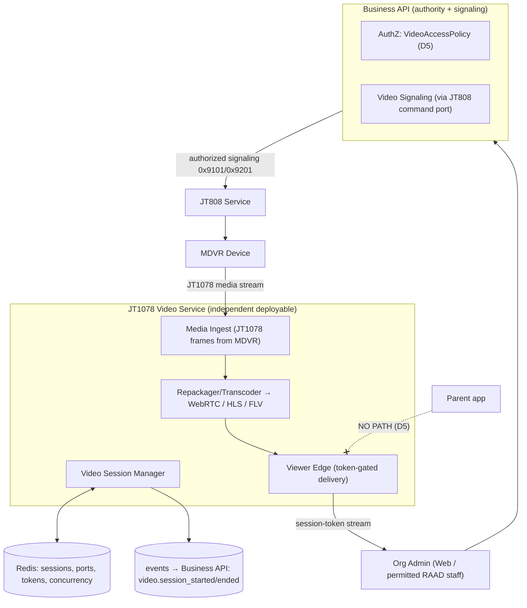
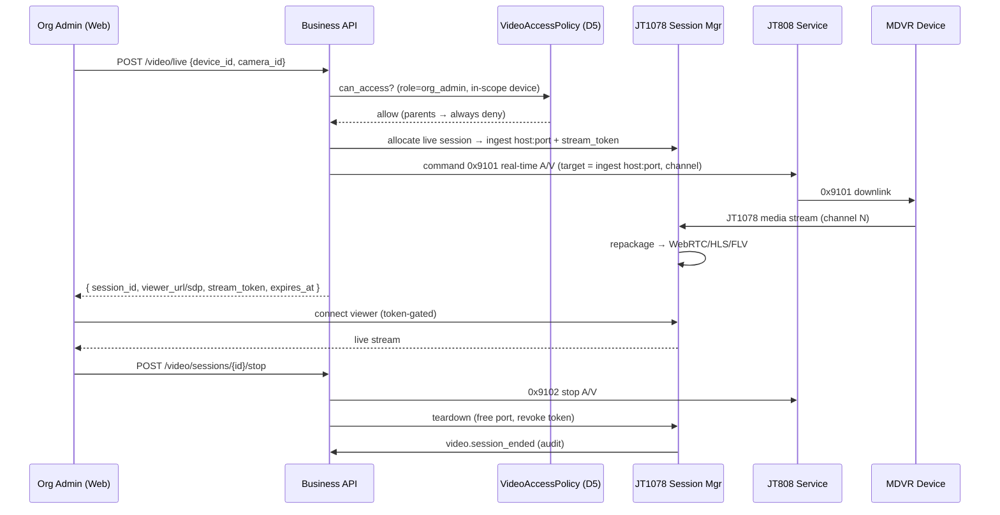
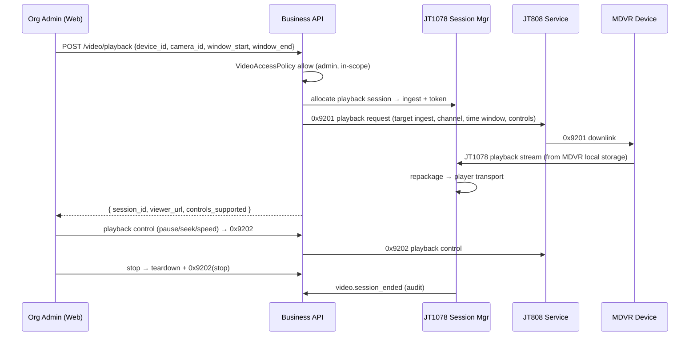
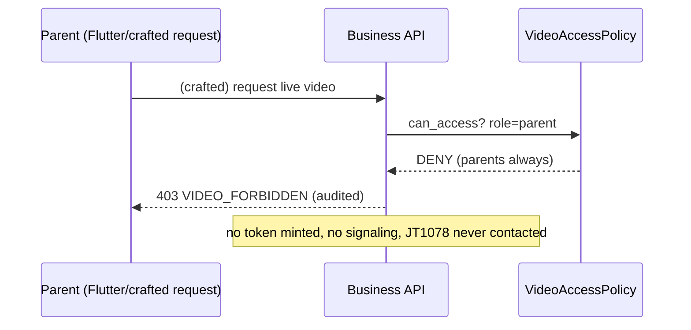
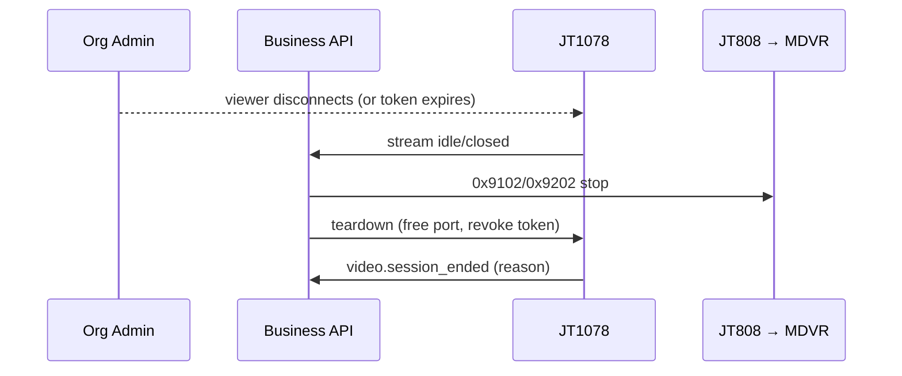

# RAAD Platform — Phase 3.5: JT1078 Video Service Technical Design (LLD)

**Prepared by:** Senior Enterprise Software Architect
**Phase:** 3.5 — JT1078 (live video / playback) service (design documentation only; **no implementation code**)
**Traceability:** Project Brief (Ch. 5.3, 8.7, 11.9), Enterprise Architecture (§4, §5.2, §11.2), Backend LLD (§6 video signaling port, policies), Database Design (§5.3 cameras, §7.4 video_sessions), API Contracts (§4.5 video routes, §3 authz), decisions **D1–D6**, **CR-1**, and the JT808 design (§12 command downlink).

**Device-plane business rules honored:** JT808 and JT1078 are **independent services**; **FastAPI never talks to devices**; JT1078 handles **only live video and playback**; **recorded video always stays inside the MDVR**; RAAD is a **real-time monitoring platform, not a cloud video store**; **parents never access live video**; **Organization Administrators may access live video and playback**.

> **Notation.** Contracts are language-neutral skeletons. JT/T 1078 signaling (invoked via JT808 `0x9101/0x9201/0x9202/0x9205`) is cited by message id; media byte formats are implementation-time detail and not reproduced.

---

## 1. Overall Video Service Architecture

JT1078 is a **standalone media service** that (a) accepts on-demand media streams *from MDVR devices*, (b) **repackages** them into browser/Flutter-playable transports, and (c) relays them to **authorized viewers only** for the duration of a session. It **stores no video** — the MDVR remains the sole system of record (brief 11.9).



**Key boundaries**
- **All authorization happens in the Business API before any signaling** (D5). JT1078 trusts a **signed, short-lived stream token** minted by the Business API; it never decides *who* may watch.
- **Signaling to the device goes through JT808** (the command downlink, JT808 §12) — JT1078 does not open a JT808 control socket; it only receives the resulting **media** stream. FastAPI never touches the device (D6).
- **Parents have no reachable path** to the viewer edge (D5) — enforced upstream (no token is ever minted for a parent) and by construction (no parent video endpoint, API §4.5).

---

## 2. Video Session Manager

Owns the lifecycle of every live/playback session.

```
VideoSessionManager (contract):
  allocate(session_req) -> {session_id, ingest_host, ingest_port, stream_token, expires_at}
      # session_req = {organization_id, device_id, camera_id, purpose(live|playback), window?, actor_ref}
  bind_media(session_id, device_stream)         # MDVR stream arrives at ingest_host:port
  issue_viewer(session_id, principal_scope) -> viewer_url|sdp   # token-gated
  stop(session_id, reason)                       # teardown, free ports, emit event
  enforce_limits(organization_id)                # concurrency ceilings
```

- **Session record:** mirrors DB `video_sessions` (§7.4) — control metadata only (device, camera, purpose, actor, timestamps, status). **No media persisted.**
- **State in Redis:** `videosession:{id}` (status, ingest port, viewer token, expiry), plus concurrency counters (`concurrency:org:{id}`, `concurrency:global`).
- **Port pool:** ingest ports (TCP/UDP for JT1078) are allocated from a pool and **reclaimed on teardown** (Phase-2 §5.2).
- Emits `video.session_started` / `video.session_ended` events for **audit** (Business API, DB §8.7).

---

## 3. Live Video Flow



- Live is **always on-demand** (Org Admin initiates); nothing streams unless a session is open (brief 11.9).
- The Business API returns viewer connection info; the client connects to the **JT1078 viewer edge** with the **stream token** — never directly to the MDVR.

---

## 4. Playback Flow



- **Playback streams from the MDVR's local storage** (SSD/SD/HDD) — RAAD requests it on demand and relays it (brief 11.9). **Availability depends on what the MDVR still retains.**
- Controls (pause/seek/fast-forward) are proxied as JT1078 playback-control commands (`0x9202`) through JT808.

---

## 5. Video Authentication

Two distinct trust relationships:

1. **Device → JT1078 (media ingest):** the MDVR streams to a **specific ingest host:port** that only the platform (via the signaled `0x9101/0x9201`) told it to use; the session is expected and **correlated** by device+channel+session. Unexpected/unsolicited inbound streams are dropped. Device identity/trust derives from the JT808 authenticated session that carried the command (JT808 §4).
2. **Viewer → JT1078 (media egress):** the viewer presents a **short-lived, signed stream token** minted by the Business API for that specific `session_id`, principal, and expiry. JT1078 validates the token signature/expiry/binding before serving a single byte. Tokens are **single-session, non-transferable, and revoked on teardown**.

JT1078 performs **no user login** — it never sees credentials; authentication of *people* is the Business API's job (Backend LLD §17), and JT1078 only checks the minted token.

---

## 6. Stream Authorization

- **Decision owner:** `VideoAccessPolicy` in the Business API (Backend LLD §5, D5). Parents/Drivers → **always deny**; Org Admin → allow within own org; RAAD staff → only where explicitly permitted and in-scope; **every** allow is audited.
- **Enforcement points (defense in depth):**
  1. **API route** (`/video/*`) — RBAC + policy; parents have no route (API §4.5).
  2. **Token minting** — a token is *only* created after an allow; **no parent token can exist**.
  3. **JT1078 edge** — serves only on a valid, matching token; no token ⇒ no stream.
  4. **Scope** — the device must belong to the actor's org/region scope (Phase-2 §12.3/§17), checked before signaling.
- **Camera-level rule (D5):** `cameras.position = in_cabin` streams are restricted to Org Admin (and permitted RAAD staff); they are **never** offered to any parent path. Org policy can further restrict which cameras admins may view.

---

## 7. Browser Streaming (Web Dashboard)

- **Transport:** **WebRTC** preferred for low-latency live (sub-second class); **HLS/FLV** offered as a fallback for compatibility and for playback scrubbing (Phase-2 §5.2).
- **Flow:** the Web Dashboard receives `{ viewer_url or SDP offer, stream_token }` from the Business API, then negotiates directly with the JT1078 viewer edge (token-gated). The dashboard **never** contacts the MDVR or speaks JT1078.
- **Player:** a standard web player component; the client holds only the ephemeral session token, no device credentials.
- **Teardown:** closing the view (or token expiry) triggers `stop` → the session is torn down and the MDVR is told to stop streaming (no idle streams draining bandwidth).

---

## 8. Flutter Video Access

- **Parent build:** **no video capability at all** (D5) — no video screens, no endpoints, no tokens. This section exists to state that explicitly: the Flutter Parent experience is GPS + notifications only (Phase-2 §9.3).
- **Driver build:** **no video** (Phase-2 §9.4) — drivers control trips only.
- Therefore JT1078 has **no Flutter client integration** in MVP. (If a future, separately-approved admin mobile experience is introduced, it would reuse the same Business-API-authorized, token-gated pattern — noted only as a dormant seam, not built.)

---

## 9. Admin Dashboard Video

- The **only** MVP video surface is the **Web Dashboard for Organization Administrators** (and permitted RAAD staff), per D5.
- Capabilities: start/stop **live** per camera on a vehicle's device; request **playback** for a time window; playback controls (pause/seek/speed). Continuous 24/7 access to *initiate* live is consistent with the admin's monitoring role (Phase-2 §23.1) — but a stream still only runs while a session is open (on-demand).
- Every open/close is written to `audit_entries` (DB §8.7) with actor, device, camera, purpose, and time.

---

## 10. Parent Access Rules (explicit — D5)

- **Parents never access live video or playback.** There is **no parent video endpoint, no token, and no viewer path** — denial is by construction, not merely by a runtime check.
- Parents receive **GPS tracking (active-trip, CR-1-gated) + trip/geofence notifications** only (Phase-2 §9.3, §23; API §4.4/§4.6).
- Even if an organization has cameras enabled, parent access remains off; the `org_settings` parent-video flag is **absent/disabled by design** for MVP (DB §4.7). This is a hard rule, and the audit trail proves no parent session can be created.

---

## 11. Recording Source (MDVR)

- **The MDVR is the system of record** for recorded video, stored on its **local media** (SSD/SD/HDD) (brief 11.9).
- **RAAD does not archive or continuously upload recorded video to the cloud** — this minimizes storage cost and server load and is a core platform principle ("real-time monitoring platform, not a cloud video store").
- **Live** = the MDVR streams *now* on request; **Playback** = the MDVR streams a *past window* from its own storage on request. In both cases RAAD **relays**, it does not **retain**.
- **Retention of footage is the MDVR's**, bounded by its device storage; playback availability therefore depends on the device's retained recordings — surfaced to admins as a best-effort capability.

---

## 12. Video Metadata

JT1078 and the Business API persist **metadata only** (never media):

| Data | Where | Notes |
|------|-------|-------|
| `video_sessions` (device, camera, purpose, actor, status, times) | Business DB §7.4 | control record, audited |
| `playback_requests` (window, controls, status) | Business DB | playback-specific |
| `cameras` (channel, position in_cabin/road_facing) | Business DB §5.3 | drives D5 camera rule |
| session runtime (ingest port, token, concurrency) | Redis (JT1078) | ephemeral hot state |
| `video.session_started/ended` | outbox → audit | traceability |

No frames, thumbnails, or recordings are stored by RAAD by default.

---

## 13. Playback Request Flow (control detail)

- **Request:** admin specifies device, camera/channel, and a time window; the Business API authorizes, allocates a JT1078 session, and signals `0x9201` (playback) via JT808 with the target ingest endpoint and window.
- **Controls:** pause / resume / seek / speed / stop map to `0x9202` playback-control commands, proxied through JT808; JT1078 adjusts the repackaged output accordingly.
- **Availability handling:** if the MDVR lacks footage for the window (overwritten/offline), the device responds accordingly and the API returns a clear "footage unavailable" result (not an error state of RAAD).
- **Teardown:** explicit stop or token expiry frees the ingest port and viewer token and emits the audit event.

---

## 14. Stream Lifecycle

```mermaid
stateDiagram-v2
  [*] --> Requested: API authorized + session allocated
  Requested --> Signaled: 0x9101/0x9201 sent via JT808
  Signaled --> Streaming: MDVR media arrives; repackaged; viewer connected
  Streaming --> Stopping: admin stop / token expiry / viewer disconnect
  Signaled --> Failed: device no-response / signaling timeout / footage unavailable
  Streaming --> Failed: media loss / device offline
  Stopping --> Ended: ports freed, token revoked, 0x9102/0x9202 stop sent
  Failed --> Ended: cleanup
  Ended --> [*]
```



- **Concurrency ceilings** (per-org + global, Phase-2 §5.2/§13.1) are checked at `Requested`; over-limit requests are refused/queued with a clear message — protecting bandwidth/CPU.
- **Idle protection:** no viewer / lost token ⇒ stop signaling to the device so nothing streams unwatched.

---

## 15. Error Handling

- **Signaling timeout / device offline:** session → `Failed`; API returns a retryable error; MDVR told to stop if partially started; ports freed.
- **Footage unavailable (playback):** distinct, non-error result surfaced to the admin (device-dependent, brief 11.9).
- **Media loss mid-stream:** session → `Failed`; viewer notified; automatic teardown; optional single re-signal attempt.
- **Concurrency exceeded:** `409/429`-class refusal with capacity messaging (API §5).
- **Token invalid/expired at edge:** `403`; no media served; audited.
- **Unexpected inbound stream** (no matching session): dropped + logged (anti-abuse).
- All failures free ports and tokens (no leaks) and emit `video.session_ended` with the failure reason for audit.

---

## 16. Performance Strategy

- **Scale by concurrent streams** (not by device count): JT1078 nodes added horizontally; a **per-org and global concurrency ceiling** bounds resource use (Phase-2 §5.2, §13.1).
- **WebRTC for low latency**; HLS/FLV where scrubbing/compatibility matter — chosen per session.
- **Repackage, don't transcode, where possible:** prefer container/transport repackaging over full re-encode to save CPU; transcode only when a client truly cannot play the source codec.
- **Sticky media routing + Redis session registry** so viewer and ingest for a session land on the same node (Phase-2 §5.2).
- **Public reachability** (stable host:port, UDP where used) is a deployment requirement (Phase-2 §11.3); port pools sized to the concurrency ceiling.
- **Back-pressure & admission control** at `Requested` prevents overload rather than degrading all sessions.

---

## 17. Security

- **Authorization upstream, tokenized egress** (§5/§6): no token ⇒ no stream; parent tokens never exist (D5).
- **Short-lived, single-session, signed tokens**; revoked on teardown; bound to principal + session + expiry.
- **Network isolation:** JT1078 media ingress in the device DMZ; viewer edge behind TLS; device-facing ports restricted (Phase-2 §11.3, §12.7).
- **Privacy (minors, in-cabin):** `in_cabin` cameras are admin-only by rule; parents categorically excluded; every access audited so in-cabin viewing is fully accountable (Phase-1 R6, D5).
- **No media at rest in RAAD:** eliminates a large class of storage-breach risk; the MDVR retains footage under the customer's physical control (brief 11.9).
- **Untrusted inputs:** device media streams and any provider callbacks treated as untrusted; only correlated, expected streams accepted.

---

## 18. Sequence Diagrams

### 18.1 Parent video attempt — denied by construction (D5)


### 18.2 Admin live session (happy path) — see §3.
### 18.3 Admin playback with controls — see §4.

### 18.4 Teardown / idle protection


---

## 19. Architecture Decision Records

| ID | Decision | Rationale | Trace |
|----|----------|-----------|-------|
| ADR-1078-1 | JT1078 independent media service; stores no video | Real-time relay only; MDVR is system of record | Rules (independent; no cloud store), brief 11.9 |
| ADR-1078-2 | Authorization in Business API; JT1078 trusts signed stream tokens | Single authority; parents excluded upstream | **D5**, Backend LLD §5 |
| ADR-1078-3 | Signaling via JT808 command downlink; JT1078 receives media only | FastAPI/JT1078 never open device control sockets | **D6**, JT808 §12 |
| ADR-1078-4 | Parents have no route/token/path to video | D5 by construction, provable via audit | **D5** |
| ADR-1078-5 | WebRTC (low-latency live) + HLS/FLV fallback; repackage-over-transcode | Latency + cost balance | Phase-2 §5.2 |
| ADR-1078-6 | Per-org + global concurrency ceilings with admission control | Bounds bandwidth/CPU; predictable cost | Phase-2 §5.2, §13.1 |
| ADR-1078-7 | Playback streams from MDVR storage on demand; availability best-effort | No cloud archive; device-retained footage | brief 11.9 |
| ADR-1078-8 | in_cabin cameras admin-only; every session audited | Minors' privacy + accountability | **D5**, Phase-1 R6 |
| ADR-1078-9 | Metadata-only persistence; ephemeral runtime in Redis | No media-at-rest risk; clean teardown | brief 11.9, DB §7.4 |
| ADR-1078-10 | No Flutter video integration (parent/driver) in MVP; dormant admin-mobile seam | Honors D5/scope; avoids unnecessary build | D5, Phase-2 §9 |

---

*End of Phase 3.5 — JT1078 Technical Design. Documentation only; no implementation code. This completes the Phase-3 technical design set; no implementation will begin until directed.*
